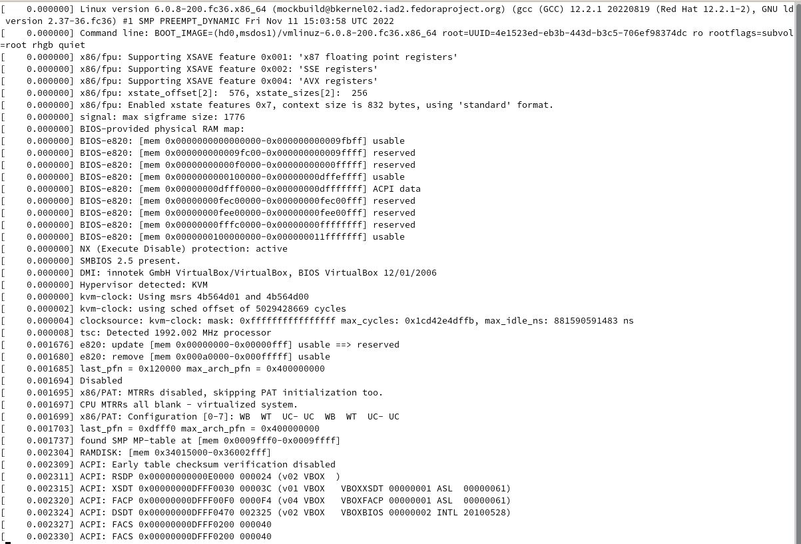
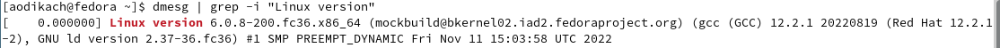
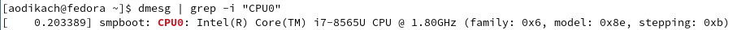
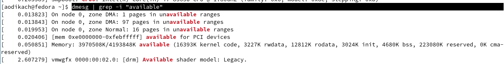
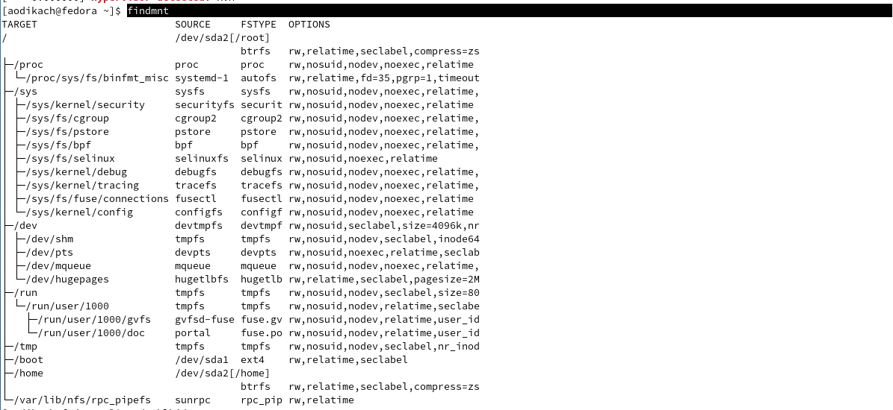
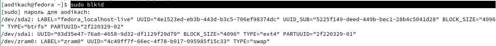
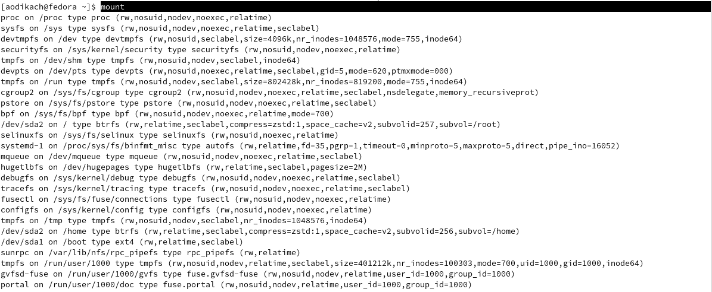

---
## Front matter
title: "Отчёт по лабораторной работе"
subtitle: "Лабораторная №1"
author: "Дикач Анна Олеговна"

## Generic otions
lang: ru-RU
toc-title: "Содержание"

## Bibliography
bibliography: bib/cite.bib
csl: pandoc/csl/gost-r-7-0-5-2008-numeric.csl

## Pdf output format
toc: true # Table of contents
toc-depth: 2
lof: true # List of figures
lot: true # List of tables
fontsize: 12pt
linestretch: 1.5
papersize: a4
documentclass: scrreprt
## I18n polyglossia
polyglossia-lang:
  name: russian
  options:
	- spelling=modern
	- babelshorthands=true
polyglossia-otherlangs:
  name: english
## I18n babel
babel-lang: russian
babel-otherlangs: english
## Fonts
mainfont: PT Serif
romanfont: PT Serif
sansfont: PT Sans
monofont: PT Mono
mainfontoptions: Ligatures=TeX
romanfontoptions: Ligatures=TeX
sansfontoptions: Ligatures=TeX,Scale=MatchLowercase
monofontoptions: Scale=MatchLowercase,Scale=0.9
## Biblatex
biblatex: true
biblio-style: "gost-numeric"
biblatexoptions:
  - parentracker=true
  - backend=biber
  - hyperref=auto
  - language=auto
  - autolang=other*
  - citestyle=gost-numeric
## Pandoc-crossref LaTeX customization
figureTitle: "Рис."
tableTitle: "Таблица"
listingTitle: "Листинг"
lofTitle: "Список иллюстраций"
lotTitle: "Список таблиц"
lolTitle: "Листинги"
## Misc options
indent: true
header-includes:
  - \usepackage{indentfirst}
  - \usepackage{float} # keep figures where there are in the text
  - \floatplacement{figure}{H} # keep figures where there are in the text
---

# Цель работы

Целью данной работы является приобретение практических навыков установки операционной системы на виртуальную машину, настройки минимально необходимых для дальнейшей работы сервисов.

 
# Выполнение лабораторной работы

Так как виртуальная машина и Fedora были установлены в первом семестре, приступаю к выполнению домашнего задания

## Домашнее задание 
1. Дожидаюсь загрузки графического окружения и открываю терминал. В окне терминала анализирую последовательность загрузки системы выполнив команду dmesg (рис. [-@fig:001])

{ #fig:001 width=70% }

2. Получаю информацию о версии ядра с помощью команды dmesg | grep -i "Linux version" (рис. [-@fig:002])

{ #fig:002 width=70% }

3. Получаю информацию о частоте процессора  с помощью команды dmesg | grep -i "Mhz processor" (рис. [-@fig:003])

{ #fig:003 width=70% }

4. Получаю информацию о модели процессора  с помощью команды dmesg | grep -i "CPU0" (рис. [-@fig:004])

{ #fig:004 width=70% }

5. Получаю информацию о объёме доступной оперативной памяти  с помощью команды dmesg | grep -i "available"
 (рис. [-@fig:005])

{ #fig:005 width=70% }

6. Получаю информацию о типе обнаруженного гипервизора  с помощью команды dmesg | grep -i "hypervisor detected" (рис. [-@fig:006])

{ #fig:006 width=70% }

7. Получаю информацию о типе файловой  системы корневого раздела с помощью команды  findmnt (рис. [-@fig:007]) или команды sudo blkid (рис. [-@fig:008])

{ #fig:007 width=70% }

{ #fig:008 width=70% }

8. Получаю информацию о частоте процессора  с помощью команды mount (рис. [-@fig:009])

{ #fig:009 width=70% }

## Ответы на вопросы

1. учётная запись хранит системное имя, идентификатор пользователя, имя и пароль сетевое имя и некоторые другие сведения необходимые для работы с пользователем

2. команды терминала для 
    -получения справки о команде: info 
    -перемещения по файловой системе: cd или mv
    -для просмотра содержимого каталога: ls
    -для определения объёма каталога: du
    -для создания/удаления каталогов/файлов: mkdir (для создания) rm/rmdir (для удаляения каталогов/файлов)
    -для задания определённых прав на файл: chmod
    -для просмотра истории команд: history
    
3. посмотреть какие файловые системы подмонтированы в ос можно с помощью команды findmnt

4. удалить зависший процесс можно с помощью команды kill или killall (вторая команда для удаления дерева процессов)
    

# Выводы

приобрела необходимые навыки установки виртуальной машины, настройке минимально необходимых сервисов и получении необходимых данных
