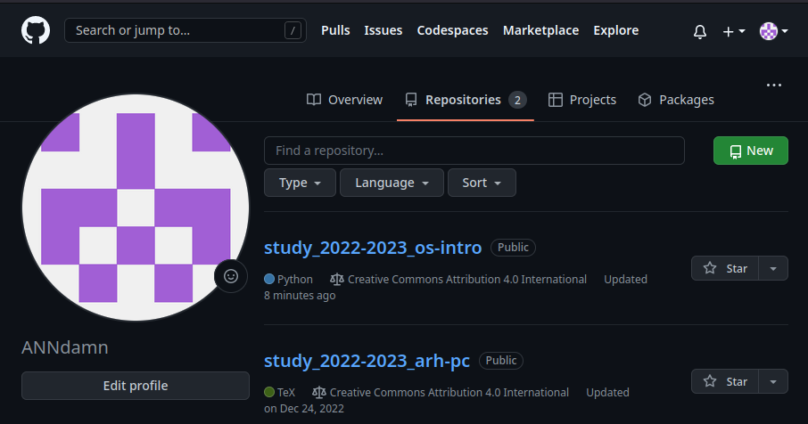
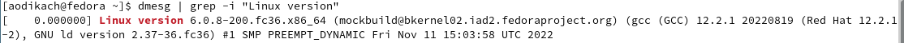
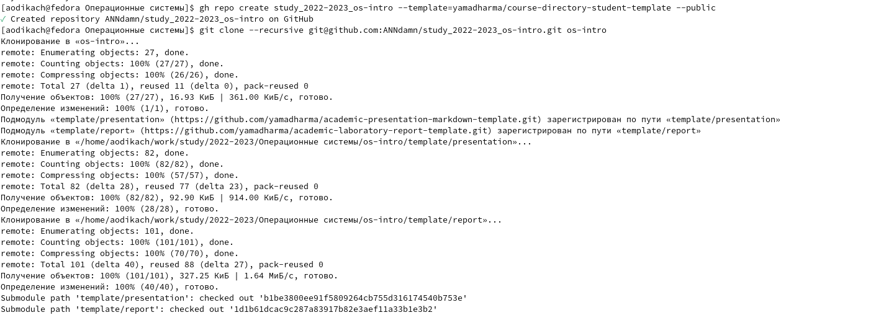
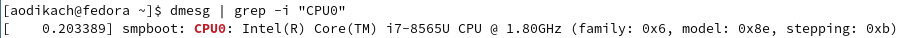
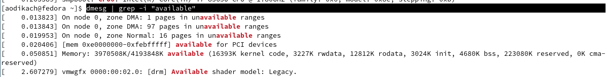
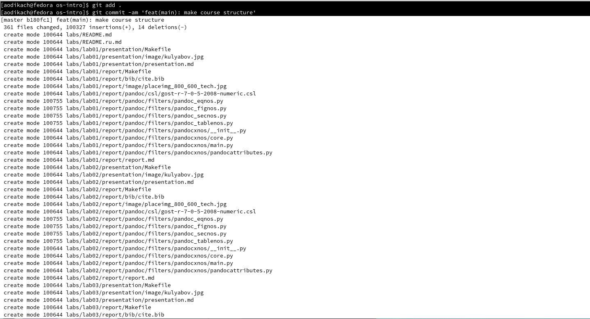
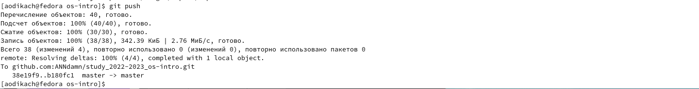
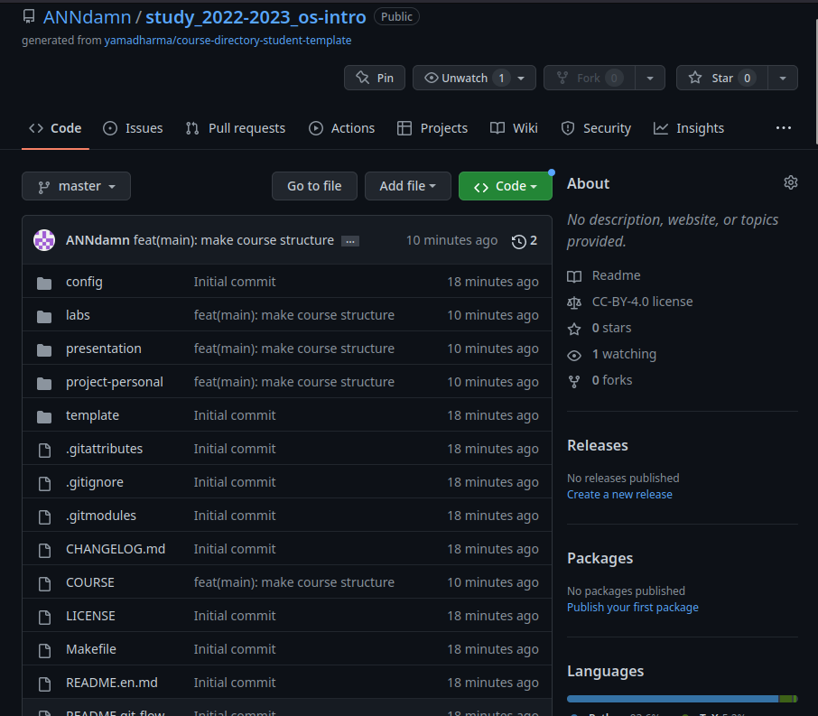

---
## Front matter
title: "Очёт по лабораторной работе"
subtitle: "Лабораторная работа №2"
author: "Дикач Анна Олеговна"

## Generic otions
lang: ru-RU
toc-title: "Содержание"

## Bibliography
bibliography: bib/cite.bib
csl: pandoc/csl/gost-r-7-0-5-2008-numeric.csl

## Pdf output format
toc: true # Table of contents
toc-depth: 2
lof: true # List of figures
lot: true # List of tables
fontsize: 12pt
linestretch: 1.5
papersize: a4
documentclass: scrreprt
## I18n polyglossia
polyglossia-lang:
  name: russian
  options:
	- spelling=modern
	- babelshorthands=true
polyglossia-otherlangs:
  name: english
## I18n babel
babel-lang: russian
babel-otherlangs: english
## Fonts
mainfont: PT Serif
romanfont: PT Serif
sansfont: PT Sans
monofont: PT Mono
mainfontoptions: Ligatures=TeX
romanfontoptions: Ligatures=TeX
sansfontoptions: Ligatures=TeX,Scale=MatchLowercase
monofontoptions: Scale=MatchLowercase,Scale=0.9
## Biblatex
biblatex: true
biblio-style: "gost-numeric"
biblatexoptions:
  - parentracker=true
  - backend=biber
  - hyperref=auto
  - language=auto
  - autolang=other*
  - citestyle=gost-numeric
## Pandoc-crossref LaTeX customization
figureTitle: "Рис."
tableTitle: "Таблица"
listingTitle: "Листинг"
lofTitle: "Список иллюстраций"
lotTitle: "Список таблиц"
lolTitle: "Листинги"
## Misc options
indent: true
header-includes:
  - \usepackage{indentfirst}
  - \usepackage{float} # keep figures where there are in the text
  - \floatplacement{figure}{H} # keep figures where there are in the text
---

# Цель работы

Изучить идеологию и приминение средств контроля версий, а также освоить умения по работе с git.

# Выполнение лабораторной работы

Так как аккаунт в Github был создан и настроен в прошлом семестре, приступаю к созданию репозитория курса на основе шаблона (рис. [-@fig:001])

{ #fig:001 width=70% }

## Создание репозитория курса на основе шаблона

1.  Создаю шаблон рабочего пространства (рис. [-@fig:002]) (рис. [-@fig:003])

{ #fig:002 width=70% }

{ #fig:003 width=70% }

## Настройка каталога курса

2. Перехожу в каталог курса (рис. [-@fig:004])

{ #fig:004 width=70% }

3. Удаляю лишние файлы (рис. [-@fig:005])

{ #fig:005 width=70% }

4. Создаю необходимые каталоги (рис. [-@fig:006])

{ #fig:006 width=70% }

5. Отправляю файлы на сервер (рис. [-@fig:007]) 

{ #fig:007 width=70% }

{ #fig:008 width=70% }

6. Итог проведённой работы (рис. [-@fig:009])

{ #fig:009 width=70% }

## Контрольные вопросы

1. Системы контроля версий (VCS) применяются при работе нескольких человек над одним проектом.  
 Система управления версиями позволяет хранить версии одного и того же документа, возвращаться к ним и следить за изменениями и фиксировать их.

2.  хранилище - место хранения файлов с которым могут взаимодействовать все участники 
    commit - делает для проекта снимок текущего состояния изменений, добавленных в раздел проиндексированных файлов. 
    история - показывает операции, которые были произведены с объектом. имеет большое количество опций для поиска коммитов по разным критериям 
    рабочая копия - является снимком одной версии проекта. файлы извлекаются из сжатой базы данных в каталоге Git и помещаются на диск для того чтобы их могли редактировать другие пользователи 

3.  Централизованные системы контроля версий представляют собой приложения типа клиент-сервер, когда репозиторий проекта существует в единственном экземпляре и хранится на сервере. Доступ к нему осуществлялся через специальное клиентское приложение. Примеры: 
CVS, Subversion
    Децентрализированные системы контроля версий (Distributed Version Control System, DVCS) позволяют хранить репозиторий (его копию) у каждого разработчика, работающего с данной системой. При этом можно выделить центральный репозиторий (условно), в который будут отправляться изменения из локальных и, с ним же эти локальные репозитории будут синхронизироваться. Примеры: Git и Mercurial

4. создания и работа с файлами, выгрузка их в хранилище. не требует создания рабочих копий. можно сделать проект конфедициальным, не доступным для других пользователей git.

5. создание репозитория, обновить проект, скопировать последнюю версию, внести изменения, разрешить конфликты, создать ветку.

6. основными задачами являются: проверка ветки, переключение на новую, написание кода, просмотр статуса, создание коммита, отправка 

7. 
    git add - добавляет содержимое рабочего каталога в индекс
    git status - показывает состояние файлов 
    git diff - используется для вычисления разницы между 
    git difftool - запускает внешнюю утилиту сравнения для показа различий двух деревьев
    git commit - берёт все данные, добавленные в индекс с помощью git add, и сохраняет их слепок во внутренней базе данных, а потом сдвигает указатель текущей ветки на этот слепок 
    git reset - используется для отмены изменений
    git rm -  используется в Git для удаления файлов из индекса и рабочей копии
    git mv - перемещает файлы, добавляет содержимое рабочего каталога в индекс нового файла и и удаляет старый
    git clean - удаляет мусор их рабочего каталога
    
8. с помощью git add пользователь изменяет файл, проверяет состояние других файлов с помощью git status, с помощью git difftool сверяет проделанную работу с работой своего партнёра, с помощью git rm  удаляет рабочую копию своего партнёра.

9. ветви нужны для того чтобы программисты могли вести совместную работу и при этом не мешать друг другу своими действиями 

10. некоторые файлы игнорируются для их исключения из истории git.

# Выводы

Создала аккаунт в Github, изучила его идеологию и применение средств контроля версий.

