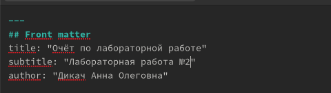
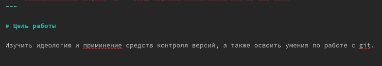
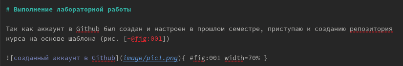
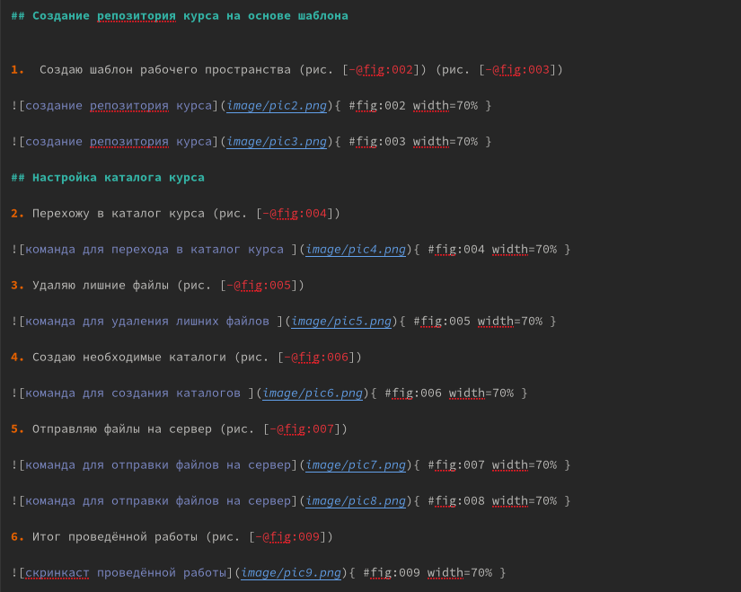
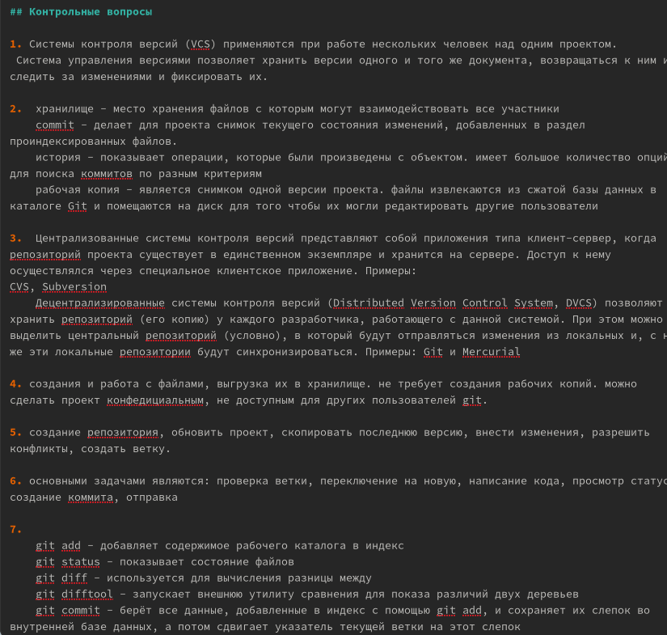
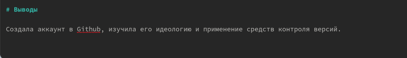

---
## Front matter
lang: ru-RU
title: Научная презентация
subtitle: Лабораторная работа №3
author:
  - Дикач А.О.
institute:
  - Российский университет дружбы народов, Москва, Россия
date: 23.02.2023г.

## i18n babel
babel-lang: russian
babel-otherlangs: english

## Formatting pdf
toc: false
toc-title: Содержание
slide_level: 2
aspectratio: 169
section-titles: true
theme: metropolis
header-includes:
 - \metroset{progressbar=frametitle,sectionpage=progressbar,numbering=fraction}
 - '\makeatletter'
 - '\beamer@ignorenonframefalse'
 - '\makeatother'
---

# Информация

## Докладчик

:::::::::::::: {.columns align=center}
::: {.column width="70%"}

  * Дикач Анна Олеговна
  * ученик НПИбд-01-22
  * Российский университет дружбы народов
  * [1132222009@pfur.ru]
  * <https://github.com/ANNdamn/study_2022-2023_os-intro>

## Объект и предмет исследования

- Базовые сведения о Markdown
- Развитие навыков быстрого составления отчётов и презентаций

## Цели и задачи

- Научиться оформлять отчёты с помощью легковесного языка разметки Markdown.

## Выполнение лабораторной работы 

1. Оформляю титульный лист 

{width=60%}

2. Формирую цели

{width=60%}

3. Пишу о заранее выполненной установке Github и прикрепляю скриншот с аккаунтом и репозиторием 

{width=60%}

4. Описываю ход выполнения лабораторной работы 

{width=60%}

5. Отвечаю на контрольные вопросы 

{width=60%}

6. Формирую вывод 

{width=60%}

## Вывод 

Научилась оформлять отчёт в Markdown, привыкла к его особенностям оформления, создала первый отчёт

:::

