---
## Front matter
lang: ru-RU
title: Научная презентация
subtitle: Лабораторная работа №4
author:
  - Дикач А.О.
institute:
  - Российский университет дружбы народов, Москва, Россия
date: 23.02.2023г.

## i18n babel
babel-lang: russian
babel-otherlangs: english

## Formatting pdf
toc: false
toc-title: Содержание
slide_level: 2
aspectratio: 169
section-titles: true
theme: metropolis
header-includes:
 - \metroset{progressbar=frametitle,sectionpage=progressbar,numbering=fraction}
 - '\makeatletter'
 - '\beamer@ignorenonframefalse'
 - '\makeatother'
---

# Информация

## Докладчик

  * Дикач Анна Олеговна
  * ученик НПИбд-01-22
  * Российский университет дружбы народов
  * [1132222009@pfur.ru]
  * <https://github.com/ANNdamn/study_2022-2023_os-intro>

## Цели и задачи

Приобретение практических навыков взаимодействия пользователя с системой посредством командной строки.

## определяю полное имя домашнего каталога

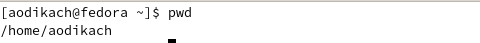{width=60%}

## перехожу в каталог  /tmp

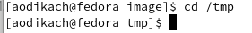{width=60%}

## список имён скрытых файлов с помощью команды ls -a

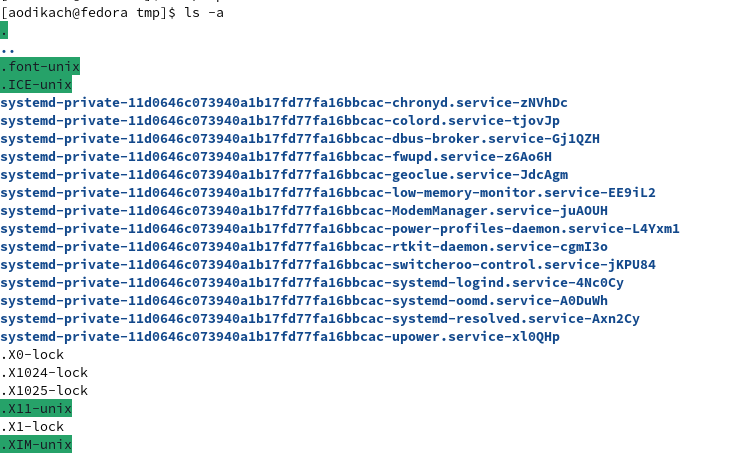{width=60%}

## содержимое каталога с помощью команды ls

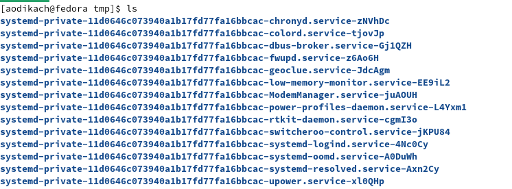{width=60%}

## подробная информация о файлах и каталогах с помощью команды ls -l

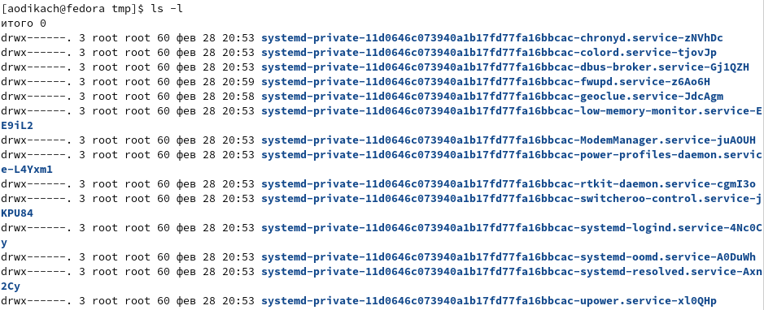{width=60%}

## определяю, есть ли в каталоге /var/spool подкаталог с именем cron с помощью ls/ такого каталога нет

{width=60%}

## перехожу в домашний каталог и вывожу его содержимое. владельцем является aodikach

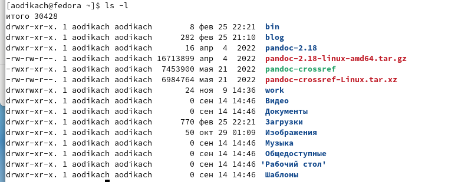{width=60%}

## в домашнем каталоге создаю новый каталог с именем newdir 

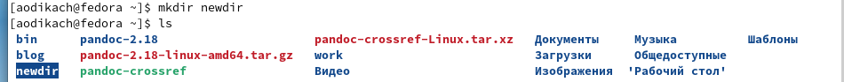{width=60%}

## в каталоге ~/newdir создаю новый каталог с именем morefun

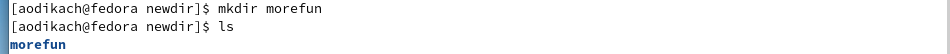{width=60%}

## в домашнем каталоге создаю одной командой три новых каталога с именами letters, memos, misk. Затем удаляю эти каталоги одной командой

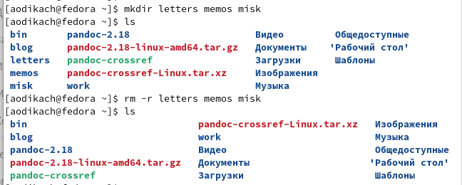{width=60%}

## удаляю созданный каталог ~/newdir и подкаталог /morefun с помощью команды rm -r newdir

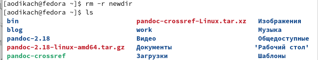{width=60%}

## с помощью команды man определяю что для просмотра отсортированного по времени последнего изменения списка нужно использовать добавочный элемент -t к ls 

{width=60%}

## cd - переход в нужный каталог, даже находящейся на другом диске

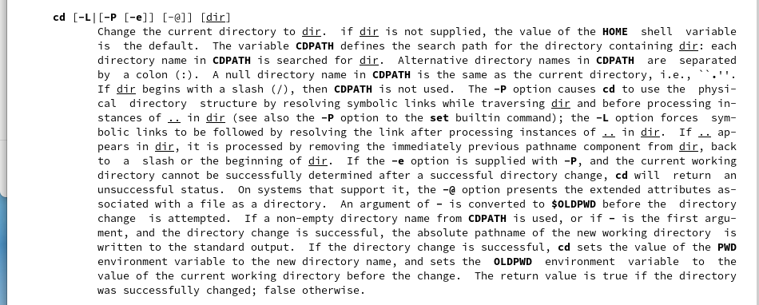{width=60%}

## pwd - вывод текущей директории

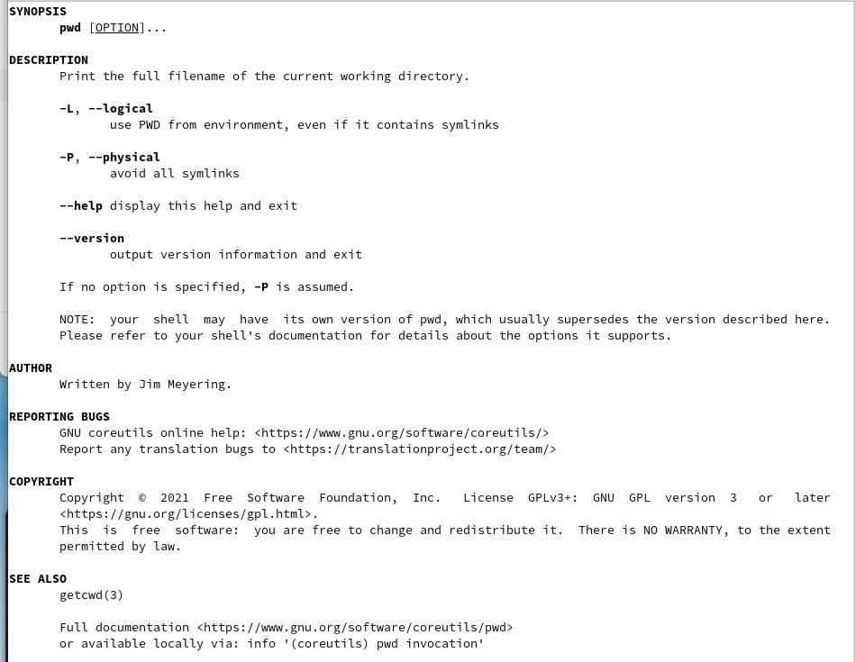{width=60%}

## mkdir - создание новых директори

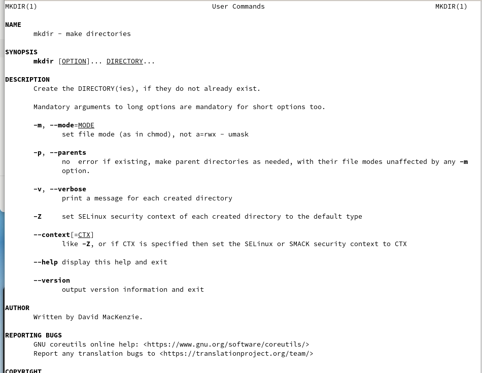{width=60%}

## rmdir - удаление пустых каталогов

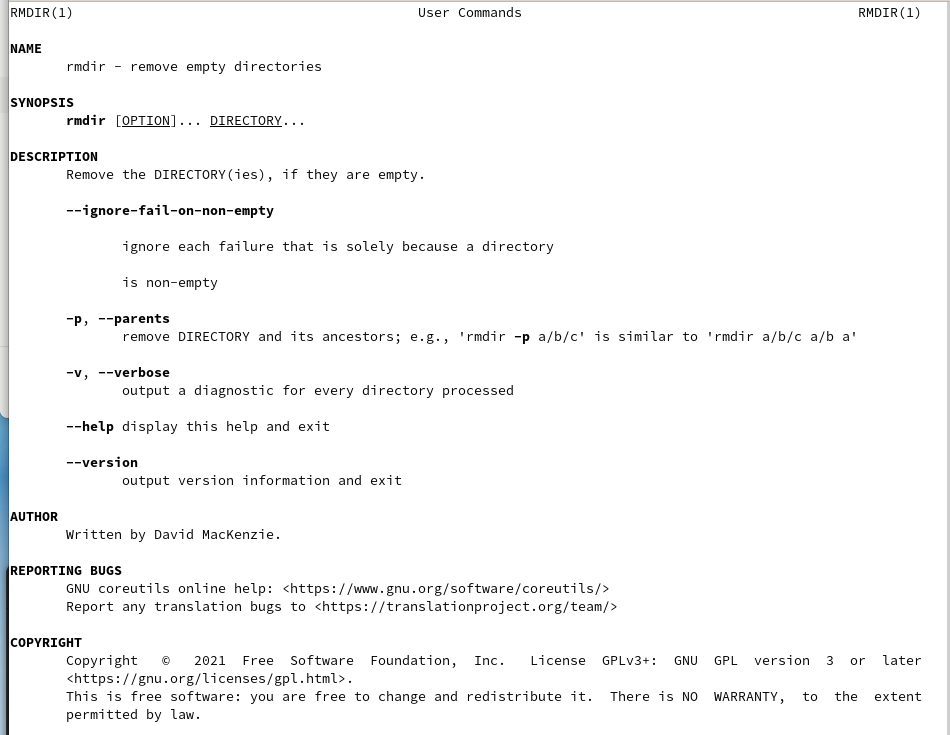{width=60%}

## rm - удаление записи об указанном файле, выбранном файле или группе файлов

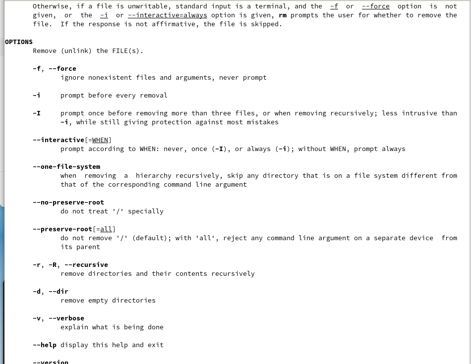{width=60%}

## с помощью команды history анализирую выполненные команды и запоминаю правильную формулировку (при неправильно использовании как с каталогом newdir)

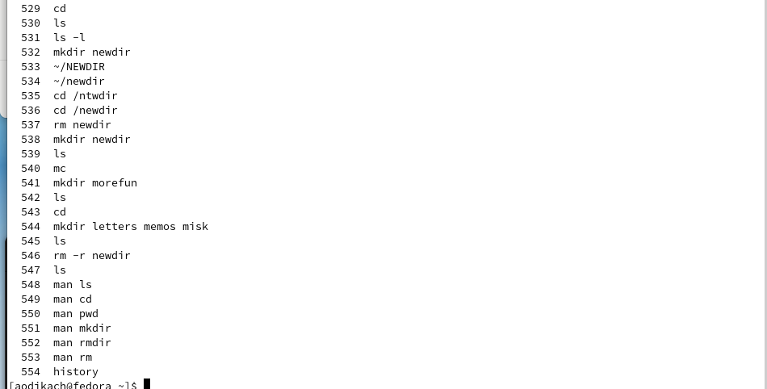{width=60%}

## Вывод 

приобрела практические навыки взаимодействия с системой посредством командной строки

