---
## Front matter
title: "Отчёт по лабораторной работе"
subtitle: "Лабораторная работа №4"
author: "Дикач Анна Олеговна"

## Generic otions
lang: ru-RU
toc-title: "Содержание"

## Bibliography
bibliography: bib/cite.bib
csl: pandoc/csl/gost-r-7-0-5-2008-numeric.csl

## Pdf output format
toc: true # Table of contents
toc-depth: 2
lof: true # List of figures
lot: true # List of tables
fontsize: 12pt
linestretch: 1.5
papersize: a4
documentclass: scrreprt
## I18n polyglossia
polyglossia-lang:
  name: russian
  options:
	- spelling=modern
	- babelshorthands=true
polyglossia-otherlangs:
  name: english
## I18n babel
babel-lang: russian
babel-otherlangs: english
## Fonts
mainfont: PT Serif
romanfont: PT Serif
sansfont: PT Sans
monofont: PT Mono
mainfontoptions: Ligatures=TeX
romanfontoptions: Ligatures=TeX
sansfontoptions: Ligatures=TeX,Scale=MatchLowercase
monofontoptions: Scale=MatchLowercase,Scale=0.9
## Biblatex
biblatex: true
biblio-style: "gost-numeric"
biblatexoptions:
  - parentracker=true
  - backend=biber
  - hyperref=auto
  - language=auto
  - autolang=other*
  - citestyle=gost-numeric
## Pandoc-crossref LaTeX customization
figureTitle: "Рис."
tableTitle: "Таблица"
listingTitle: "Листинг"
lofTitle: "Список иллюстраций"
lotTitle: "Список таблиц"
lolTitle: "Листинги"
## Misc options
indent: true
header-includes:
  - \usepackage{indentfirst}
  - \usepackage{float} # keep figures where there are in the text
  - \floatplacement{figure}{H} # keep figures where there are in the text
---

# Цель работы

Приобретение практических навыков взаимодействия пользователя с системой посредством командной строки.

# Выполнение лабораторной работы

1.  определяю полное имя домашнего каталога (рис. [-@fig:001])

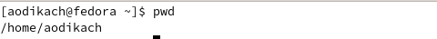{ #fig:001 width=70% }

2. выполняю следующие действия:
- перехожу в каталог  /tmp (рис. [-@fig:020])

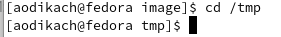{ #fig:020 width=70% }

- вывожу на экран содержимое каталога различными опциями ls (рис. [-@fig:002]) (рис. [-@fig:003]) (рис. [-@fig:004])

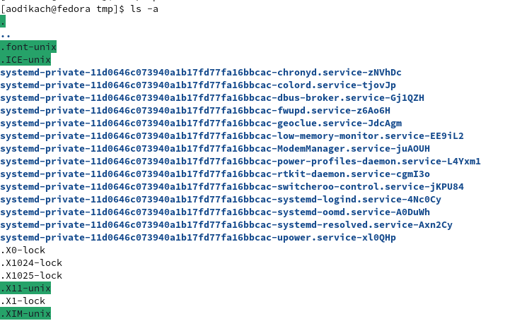{ #fig:002 width=70% }

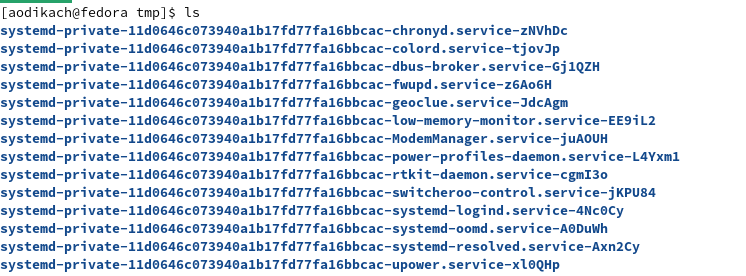{ #fig:003 width=70% }

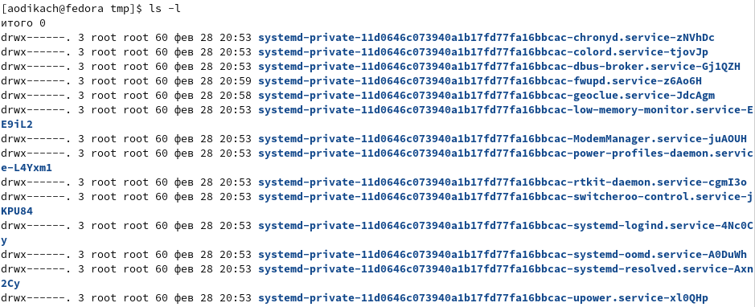{ #fig:004 width=70% }

- определяю, есть ли в каталоге /var/spool подкаталог с именем cron с помощью ls/ такого каталога нет (рис. [-@fig:005])

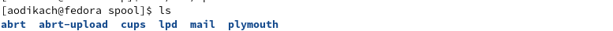{ #fig:005 width=70% }

- перехожу в домашний каталог и вывожу его содержимое. владельцем является aodikach (рис. [-@fig:006])

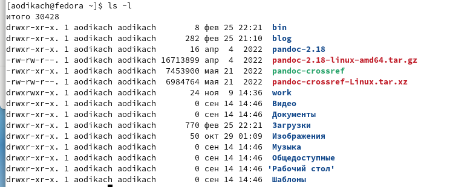{ #fig:006 width=70% }

3. выполняю следующие действия:

- в домашнем каталоге создаю новый каталог с именем newdir (рис. [-@fig:007])

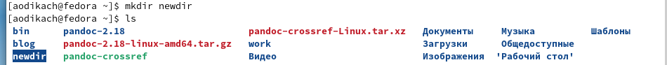{ #fig:007 width=70% }

- в каталоге ~/newdir создаю новый каталог с именем morefun (рис. [-@fig:008])

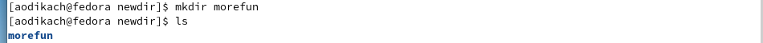{ #fig:008 width=70% }

- в домашнем каталоге создаю одной командой три новых каталога с именами
letters, memos, misk. Затем удаляю эти каталоги одной командой. (рис. [-@fig:010])

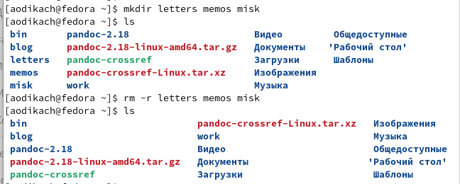{ #fig:010 width=70% }

- удаляю созданный каталог ~/newdir и подкаталог /morefun с помощью команды rm -r newdir (рис. [-@fig:011])

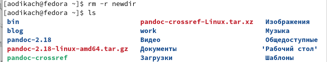{ #fig:011 width=70% }

4. с помощью команды man определяю что для просмотра содержимого не только указанного каталога, но и подкаталогов, входящих в него, нужно использовать добавочный элемент -R к ls (рис. [-@fig:012])

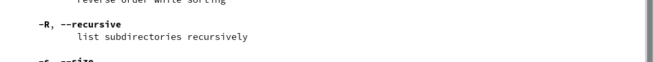{ #fig:012 width=70% }

5. с помощью команды man определяю что для просмотра отсортированного по времени последнего изменения списка нужно использовать добавочный элемент -t к ls (рис. [-@fig:013])

{ #fig:013 width=70% }

6. основные опции команд:

- cd - переход в нужный каталог, даже находящейся на другом диске (рис. [-@fig:014])

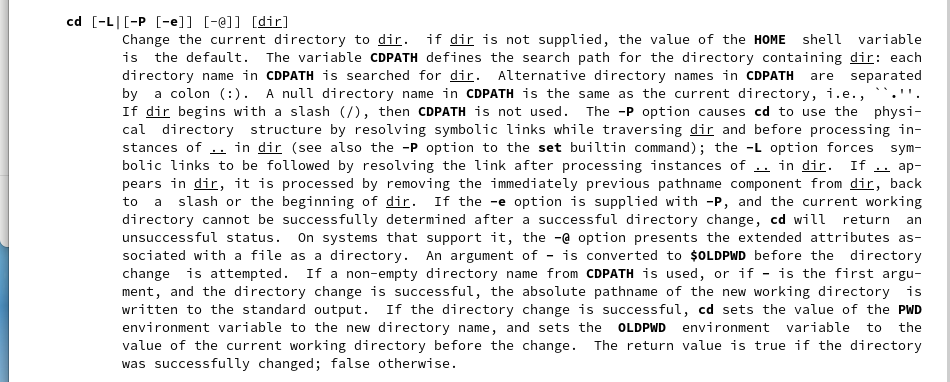{ #fig:014 width=70% }

- pwd - вывод текущей директории (рис. [-@fig:015])

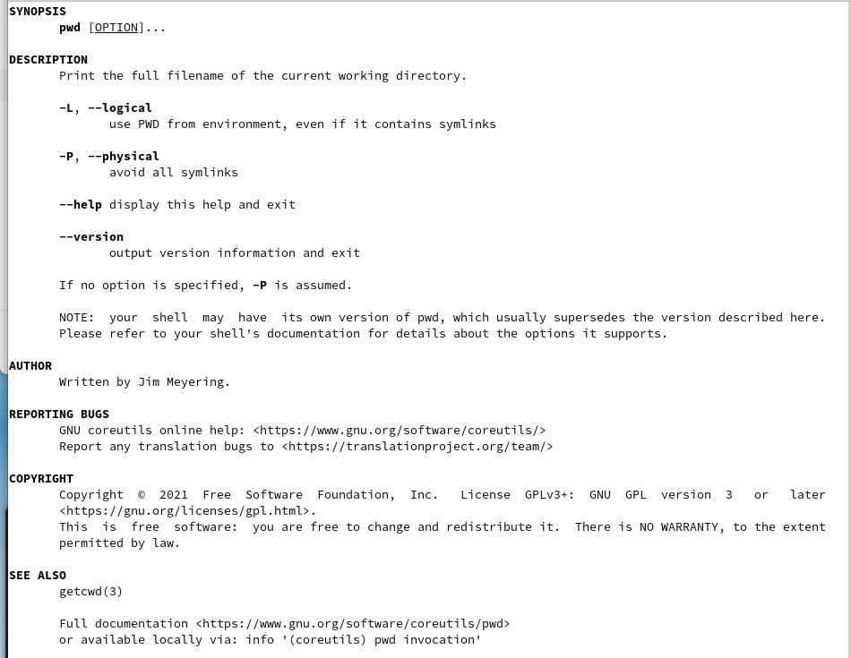{ #fig:015 width=70% }

- mkdir - создание новых директорий (рис. [-@fig:016])

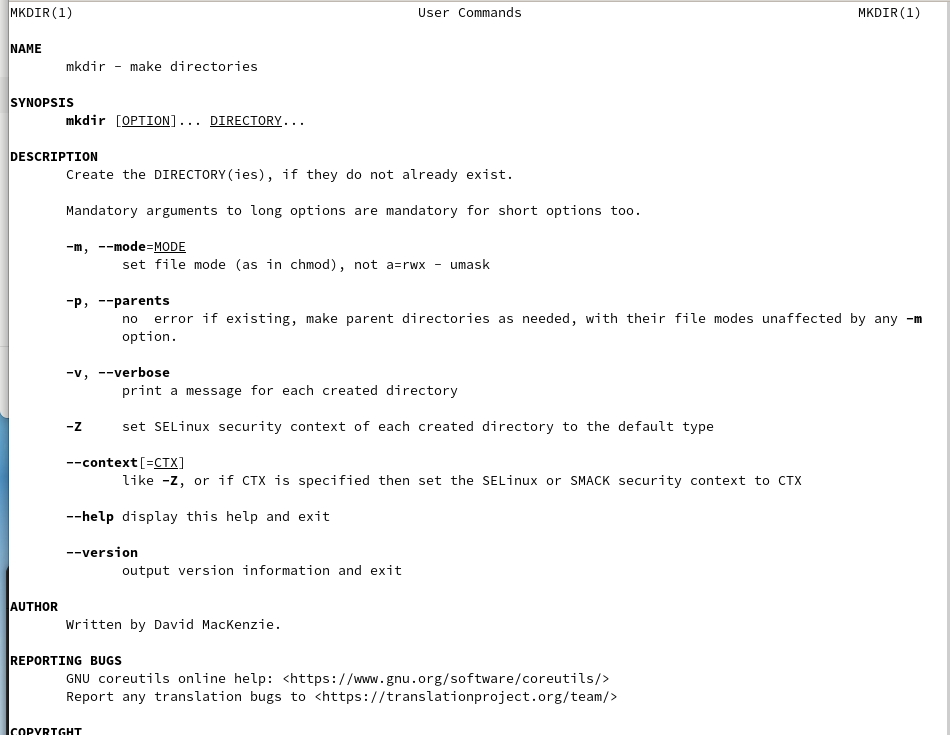{ #fig:016 width=70% }

- rmdir - удаление пустых каталогов (рис. [-@fig:017])

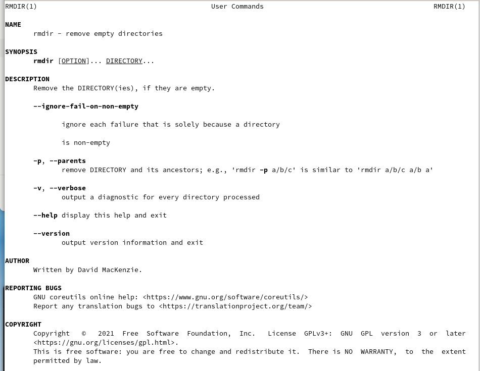{ #fig:017 width=70% }

- rm - удаление записи об указанном файле, выбранном файле или группе файлов (рис. [-@fig:018])

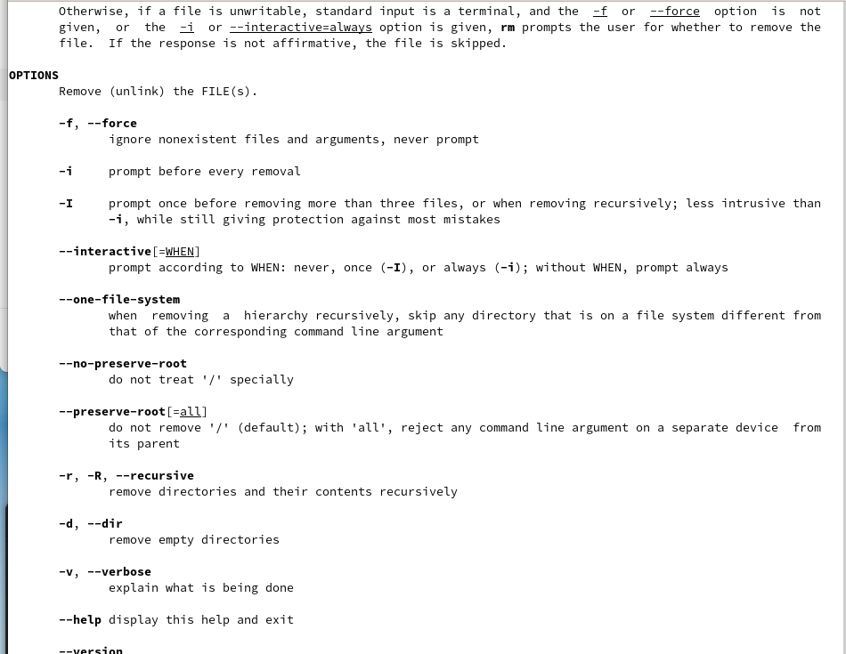{ #fig:018 width=70% }

7. с помощью команды history анализирую выполненные команды и запоминаю правильную формулировку (при неправильно использовании как с каталогом newdir) (рис. [-@fig:019])

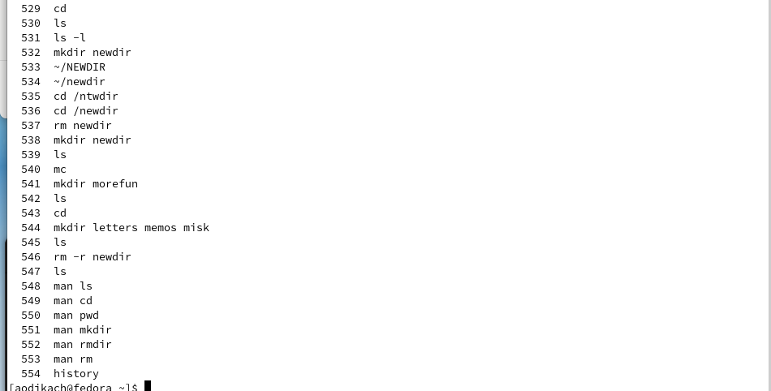{ #fig:019 width=70% }

# Выводы

приобрела практические навыки взаимодействия с системой посредством командной строки

