---
## Front matter
lang: ru-RU
title: Научная презентация
subtitle: Лабораторная работа №4
author:
  - Дикач А.О.
institute:
  - Российский университет дружбы народов, Москва, Россия
date: 23.02.2023г.

## i18n babel
babel-lang: russian
babel-otherlangs: english

## Formatting pdf
toc: false
toc-title: Содержание
slide_level: 2
aspectratio: 169
section-titles: true
theme: metropolis
header-includes:
 - \metroset{progressbar=frametitle,sectionpage=progressbar,numbering=fraction}
 - '\makeatletter'
 - '\beamer@ignorenonframefalse'
 - '\makeatother'
---

# Информация

## Докладчик

  * Дикач Анна Олеговна
  * ученик НПИбд-01-22
  * Российский университет дружбы народов
  * [1132222009@pfur.ru]
  * <https://github.com/ANNdamn/study_2022-2023_os-intro>

## Цели и задачи

Ознакомление с файловой системой Linux, её структурой, именами и содержанием
каталогов. Приобретение практических навыков по применению команд для работы
с файлами и каталогами, по управлению процессами (и работами), по проверке использования диска и обслуживанию файловой системы.

## выполняю все примеры из первой части описания лабораторной работы

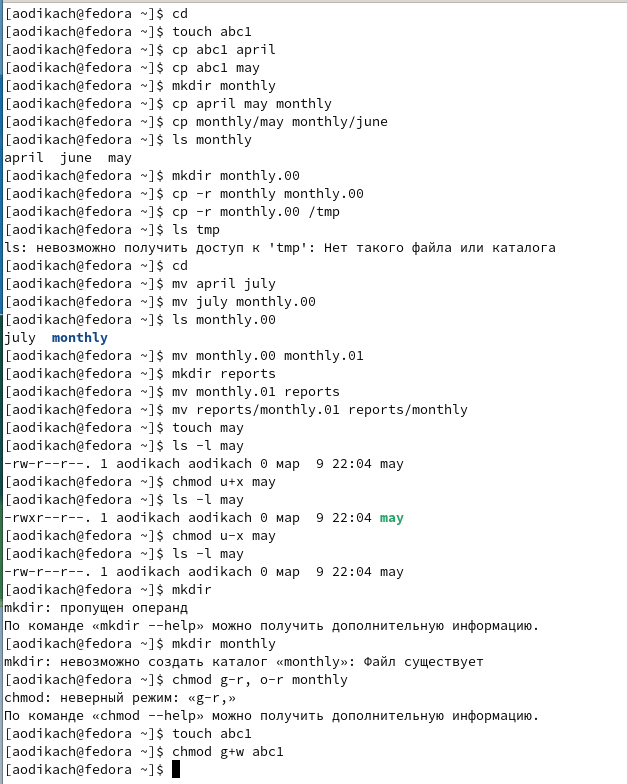{ #fig:001 width=70% }

## копирую файл /usr/include/sys/io.h в домашний каталог и назsваю его equipment 

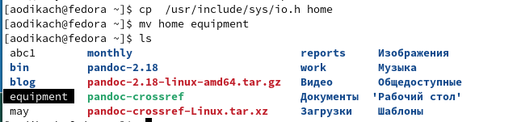{ #fig:002 width=70% }

## создаю директорию ~/ski.plases 

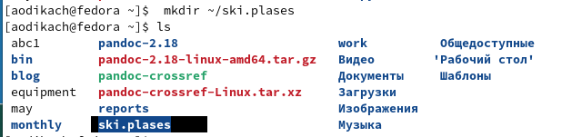{ #fig:003 width=70% }

## перемещаю файл  equipment в каталог ~/ski.plases 

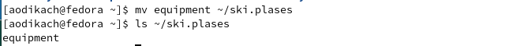{ #fig:004 width=70% }

## переименовываю файл ~/ski.plases/equipment в ~/ski.plases/equiplist

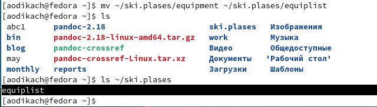{ #fig:005 width=70% }

## cоздаю в домашнем каталоге файл abc1 и копирую его в каталог ~/ski.plases, называю его equiplist2  

{ #fig:006 width=70% }

## создаю каталог с именем equipment в каталоге ~/ski.plases

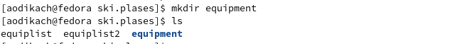{ #fig:007 width=70% }

## перемещаю файлы ~/ski.plases/equiplist и equiplist2 в каталог ~/ski.plases/equipment 

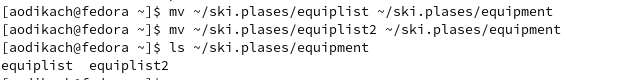{ #fig:008 width=70% }

## создаю и перемещаю каталог ~/newdir в каталог ~/ski.plases и называю его plans

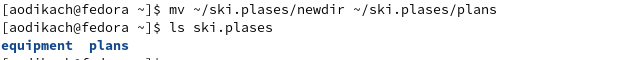{ #fig:009 width=70% }

## определяю опции команды chmod:
1) drwxr--r-- ... australia - владелец каталога australia имеет право на просмотр, изменение и доступ в каталог, члены группы могут только читать файл
2) drwx--x--x ... play - владелец каталога play имеет право на чтение исполнение и запись, все остальные пользователи только на выполнение 
3) -r-xr--r-- ... my_os - владелец файла my_os может только читать его,  группа, в которую входит владелец, может выполнять и читать, а остальные только читать
4) -rw-rw-r-- ... feathers - владелец файла feathers и члены группы могут читать и изменять файл, остальные только читать

## копирую файл  ~/feathers в файл ~/file.old 

{ #fig:010 width=70% }

## перемещаю файл ~/file.old в каталог ~/play 

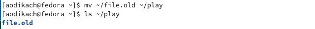{ #fig:011 width=70% }

## копирую каталог ~/play в каталог ~/fun 

{ #fig:012 width=70% }

## перемещаю каталог ~/fun в каталог ~/play и называю его games 

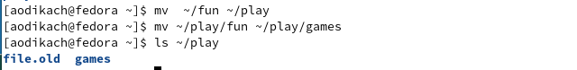{ #fig:013 width=70% }

## лишение владельца прав на чтение 

{ #fig:014 width=70% }

## после лишения прав невозможно просмотреть файл и  скопировать его 

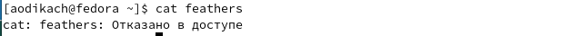{ #fig:015 width=50% }

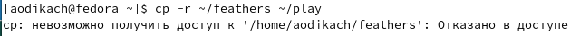{ #fig:016 width=50% }

## даю владельцу права на чтение ~/feathers 

{ #fig:017 width=70% }

## лишаю владельца прав на выполнение каталога ~/play. при переходе в каталог владельцу отказывает в доступе 

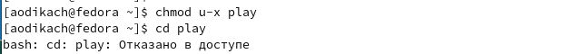{ #fig:018 width=70% }

## даю права владельцу на выполнение каталога 

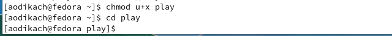{ #fig:019 width=70% }

## mount - применяется для монтирования файловых систем. используется для sd, usb, dvd и других съёмных накопителей 

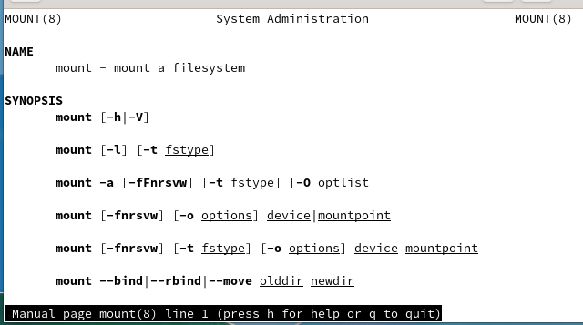{ #fig:020 width=70% }

##  fsck - проверяет и восстанавливает файловые системы 

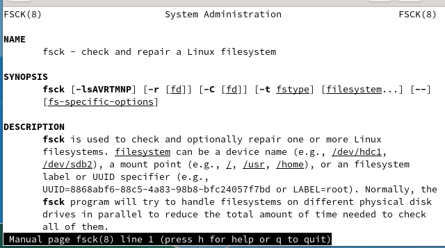{ #fig:021 width=70% }

##  mkfs - используется для создания файловой системы 

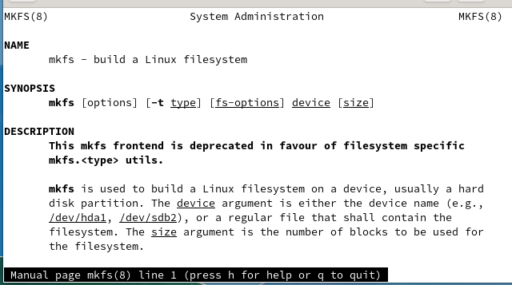{ #fig:022 width=70% }

## kill - отправляет системные сигналы определённым процессам

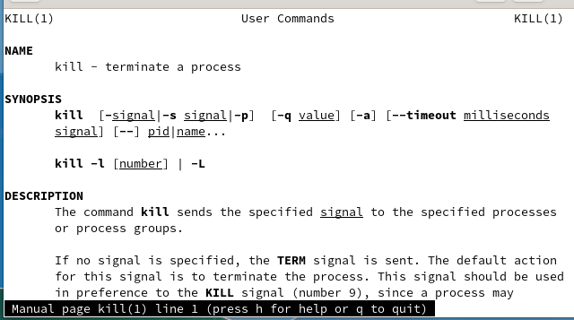{ #fig:023 width=70% }

## Вывод 

ознакомилась с файловой системой, её структурой, именами и содержанием каталогов. приобрела практический навык по применению команд.

