---
## Front matter
title: "Отчёт по лабораторной работе"
subtitle: "Лабораторная работа №5"
author: "Дикач Анна Олеговна"

## Bibliography
bibliography: bib/cite.bib
csl: pandoc/csl/gost-r-7-0-5-2008-numeric.csl

## Pdf output format
toc: true # Table of contents
toc-depth: 2
lof: true # List of figures
lot: true # List of tables
fontsize: 12pt
linestretch: 1.5
papersize: a4
documentclass: scrreprt
## I18n polyglossia
polyglossia-lang:
  name: russian
  options:
	- spelling=modern
	- babelshorthands=true
polyglossia-otherlangs:
  name: english
## I18n babel
babel-lang: russian
babel-otherlangs: english
## Fonts
mainfont: PT Serif
romanfont: PT Serif
sansfont: PT Sans
monofont: PT Mono
mainfontoptions: Ligatures=TeX
romanfontoptions: Ligatures=TeX
sansfontoptions: Ligatures=TeX,Scale=MatchLowercase
monofontoptions: Scale=MatchLowercase,Scale=0.9
## Biblatex
biblatex: true
biblio-style: "gost-numeric"
biblatexoptions:
  - parentracker=true
  - backend=biber
  - hyperref=auto
  - language=auto
  - autolang=other*
  - citestyle=gost-numeric
## Pandoc-crossref LaTeX customization
figureTitle: "Рис."
tableTitle: "Таблица"
listingTitle: "Листинг"
lofTitle: "Список иллюстраций"
lotTitle: "Список таблиц"
lolTitle: "Листинги"
## Misc options
indent: true
header-includes:
  - \usepackage{indentfirst}
  - \usepackage{float} # keep figures where there are in the text
  - \floatplacement{figure}{H} # keep figures where there are in the text
---

# Цель работы
Ознакомление с файловой системой Linux, её структурой, именами и содержанием
каталогов. Приобретение практических навыков по применению команд для работы
с файлами и каталогами, по управлению процессами (и работами), по проверке использования диска и обслуживанию файловой системы.

# Выполнение лабораторной работы

1. выполняю все примеры из первой части описания лабораторной работы (рис. [-@fig:001])

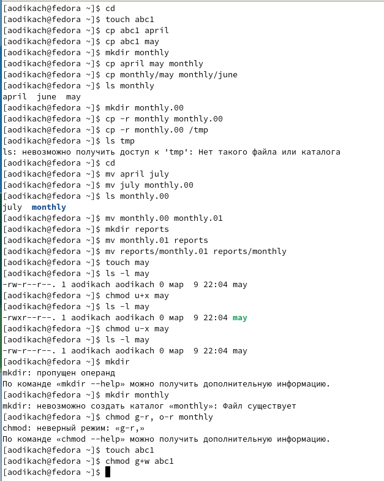{ #fig:001 width=70% }

2. копирую файл /usr/include/sys/io.h в домашний каталог и назsваю его equipment (рис. [-@fig:002])

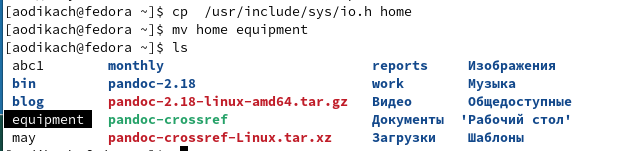{ #fig:002 width=70% }

3. создаю директорию ~/ski.plases (рис. [-@fig:003])

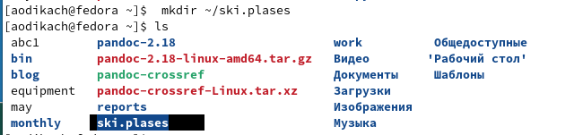{ #fig:003 width=70% }

4. перемещаю файл  equipment в каталог ~/ski.plases (рис. [-@fig:004])

{ #fig:004 width=70% }

5. переименовываю файл ~/ski.plases/equipment в ~/ski.plases/equiplist (рис. [-@fig:005])

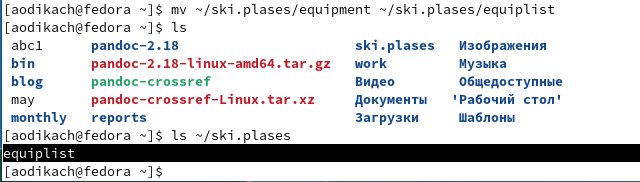{ #fig:005 width=70% }

6. создаю в домашнем каталоге файл abc1 и копирую его в каталог ~/ski.plases, называю его equiplist2  (рис. [-@fig:006])

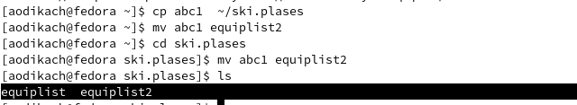{ #fig:006 width=70% }

7. создаю каталог с именем equipment в каталоге ~/ski.plases (рис. [-@fig:007])

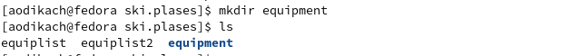{ #fig:007 width=70% }

8. перемещаю файлы ~/ski.plases/equiplist и equiplist2 в каталог ~/ski.plases/equipment (рис. [-@fig:008])

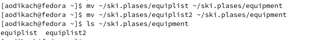{ #fig:008 width=70% }

9. создаю и перемещаю каталог ~/newdir в каталог ~/ski.plases и называю его plans (рис. [-@fig:009])

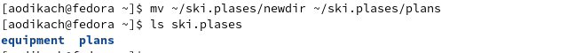{ #fig:009 width=70% }

10. определяю опции команды chmod:
1) drwxr--r-- ... australia - владелец каталога australia имеет право на просмотр, изменение и доступ в каталог, члены группы могут только читать файл
2) drwx--x--x ... play - владелец каталога play имеет право на чтение исполнение и запись, все остальные пользователи только на выполнение 
3) -r-xr--r-- ... my_os - владелец файла my_os может только читать его,  группа, в которую входит владелец, может выполнять и читать, а остальные только читать
4) -rw-rw-r-- ... feathers - владелец файла feathers и члены группы могут читать и изменять файл, остальные только читать

11. копирую файл  ~/feathers в файл ~/file.old (рис. [-@fig:010])

{ #fig:010 width=70% }

12. перемещаю файл ~/file.old в каталог ~/play (рис. [-@fig:011])

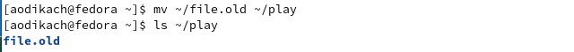{ #fig:011 width=70% }

13. копирую каталог ~/play в каталог ~/fun (рис. [-@fig:012])

{ #fig:012 width=70% }

14. перемещаю каталог ~/fun в каталог ~/play и называю его games (рис. [-@fig:013])

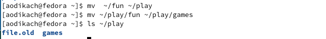{ #fig:013 width=70% }

15. лишение владельца прав на чтение (рис. [-@fig:014])

{ #fig:014 width=70% }

16. после лишения прав невозможно просмотреть файл и  скопировать его (рис. [-@fig:015]) (рис. [-@fig:016])

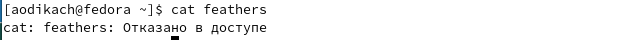{ #fig:015 width=70% }

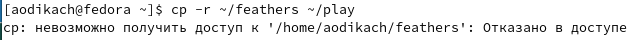{ #fig:016 width=70% }

17. даю владельцу права на чтение ~/feathers (рис. [-@fig:017])

{ #fig:017 width=70% }

18. лишаю владельца прав на выполнение каталога ~/play (рис. [-@fig:018]). при переходе в каталог владельцу отказывает в доступе 

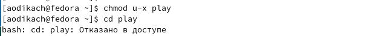{ #fig:018 width=70% }

19. даю права владельцу на выполнение каталога (рис. [-@fig:019])

{ #fig:019 width=70% }

20. команды:
mount - применяется для монтирования файловых систем. используется для sd, usb, dvd и других съёмных накопителей (рис. [-@fig:020])

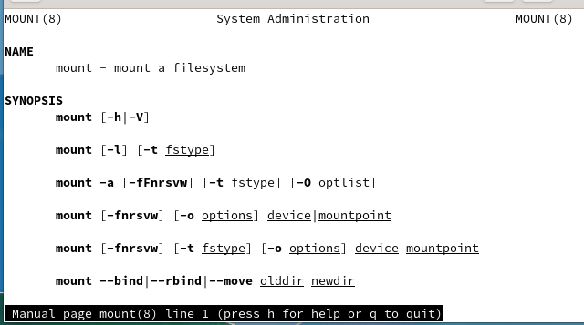{ #fig:020 width=70% }

 fsck - проверяет и восстанавливает файловые системы (рис. [-@fig:021])

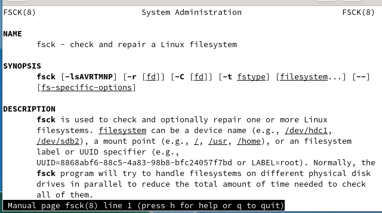{ #fig:021 width=70% }
 
 mkfs - используется для создания файловой системы (рис. [-@fig:022])

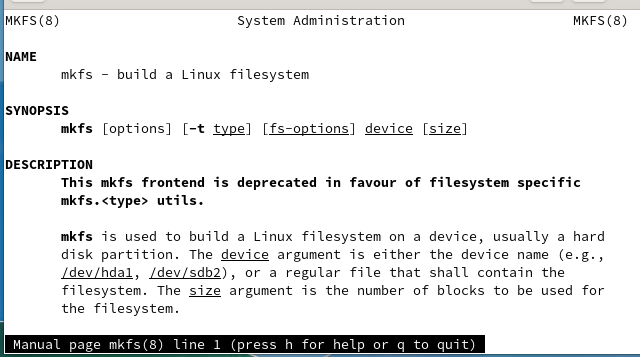{ #fig:022 width=70% }
 
 kill - отправляет системные сигналы определённым процессам (рис. [-@fig:02])

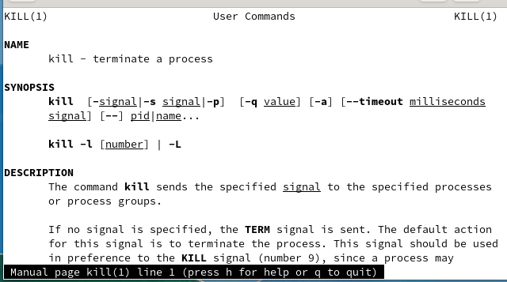{ #fig:023 width=70% }

# Вывод

ознакомилась с файловой системой, её структурой, именами и содержанием каталогов. приобрела практический навык по применению команд.

:::
