---
## Front matter
lang: ru-RU
title: Презентация
subtitle: Лабораторная работа №6
author:
  - Дикач А.О.
institute:
  - Российский университет дружбы народов, Москва, Россия
date: 17.03.2023г.

## i18n babel
babel-lang: russian
babel-otherlangs: english

## Formatting pdf
toc: false
toc-title: Содержание
slide_level: 2
aspectratio: 169
section-titles: true
theme: metropolis
header-includes:
 - \metroset{progressbar=frametitle,sectionpage=progressbar,numbering=fraction}
 - '\makeatletter'
 - '\beamer@ignorenonframefalse'
 - '\makeatother'
---

# Информация

## Докладчик

  * Дикач Анна Олеговна
  * ученик НПИбд-01-22
  * Российский университет дружбы народов
  * [1132222009@pfur.ru]
  * <https://github.com/ANNdamn/study_2022-2023_os-intro>

## Цели и задачи

Ознакомление с инструментами поиска файлов и фильтрации текстовых данных.
Приобретение практических навыков: по управлению процессами (и заданиями), по
проверке использования диска и обслуживанию файловых систем.

## записываю в файл file.txt названия файлов, содержащихся в каталоге /etc, дозаписываю названия файлов из домашнего каталога

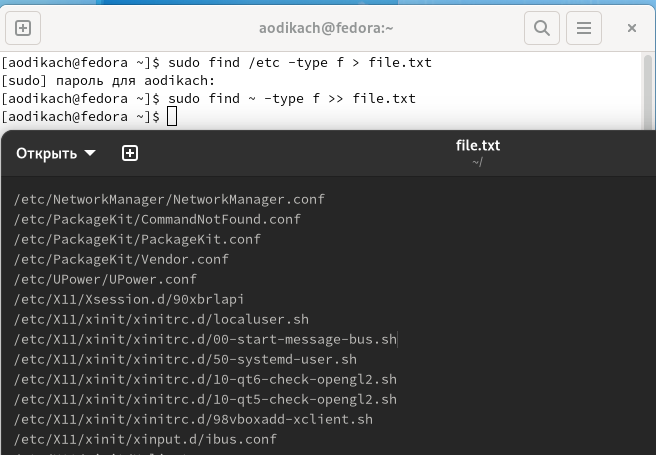{ #fig:001 width=70% }

## вывожу имена всех файлов из file.txt, имеющих расширение .conf, после чего записываю их в новый текстовой файл conf.txt

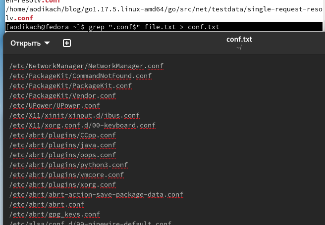{ #fig:002 width=70% }

## определяю какие файлы в вашем домашнем каталоге имеют имена, начинавшиеся с символа c. делаю это с помощью команды ls и sudo 

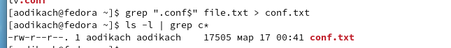{ #fig:003 width=50% }

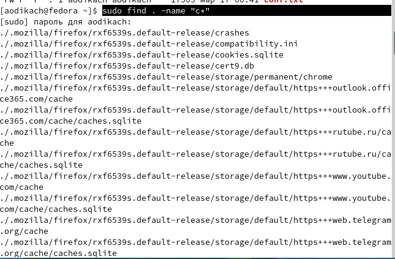{ #fig:004 width=50% }

## вывожу на экран (по странично) имена файлов из каталога /etc, начинающиеся с символа h

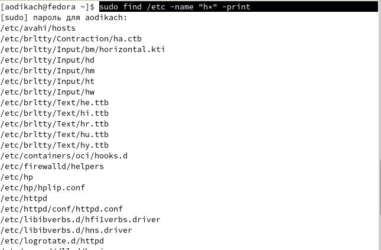{ #fig:005 width=70% }

## запускаю  в фоновом режиме процесс, который будет записывать в файл ~/logfile файлы, имена которых начинаются с log и удаляю файл ~/logfile

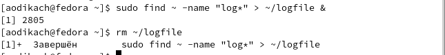{ #fig:006 width=70% }

## запускаю  из консоли в фоновом режиме редактор gedit 

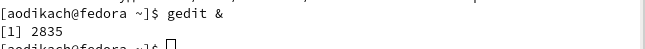{ #fig:007 width=70% }

## определяю идентификатор процесса gedit, используя команду ps, конвейер и фильтр grep (идентификатор 2835), также идентификатор выводится при использовании pidof 

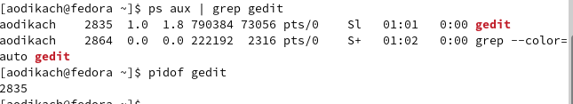{ #fig:008 width=70% }

## читаю справку (man) команды kill, после чего использую её для завершения процесса gedit 

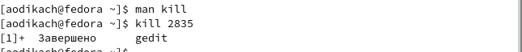{ #fig:009 width=70% }

## выполняю команды df и du, предварительно получив более подробную информацию об этих командах, с помощью команды man 

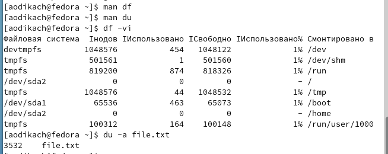{ #fig:010 width=70% }

## вывожу имена всех директорий, имеющихся в вашем домашнем каталоге с помощью команды sudo find . -type d 

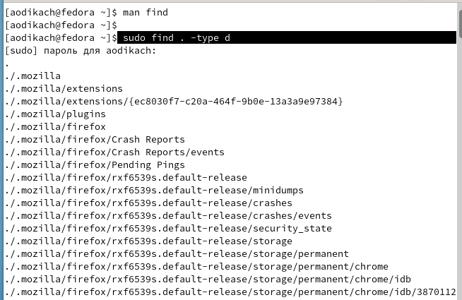{ #fig:011 width=70% }

## Вывод 

Ознакомилась с инструментами поиска файлов и фильтрации текстовых данных. приобрела практический навык по управлению процессами, проверке использования диска и обслуживанию файловых систем

