---
## Front matter
title: "Отчёт по лабораторной работе"
subtitle: "Лабораторная работа №6"
author: "Дикач Анна Олеговна"

## Bibliography
bibliography: bib/cite.bib
csl: pandoc/csl/gost-r-7-0-5-2008-numeric.csl

## Pdf output format
toc: true # Table of contents
toc-depth: 2
lof: true # List of figures
lot: true # List of tables
fontsize: 12pt
linestretch: 1.5
papersize: a4
documentclass: scrreprt
## I18n polyglossia
polyglossia-lang:
  name: russian
  options:
	- spelling=modern
	- babelshorthands=true
polyglossia-otherlangs:
  name: english
## I18n babel
babel-lang: russian
babel-otherlangs: english
## Fonts
mainfont: PT Serif
romanfont: PT Serif
sansfont: PT Sans
monofont: PT Mono
mainfontoptions: Ligatures=TeX
romanfontoptions: Ligatures=TeX
sansfontoptions: Ligatures=TeX,Scale=MatchLowercase
monofontoptions: Scale=MatchLowercase,Scale=0.9
## Biblatex
biblatex: true
biblio-style: "gost-numeric"
biblatexoptions:
  - parentracker=true
  - backend=biber
  - hyperref=auto
  - language=auto
  - autolang=other*
  - citestyle=gost-numeric
## Pandoc-crossref LaTeX customization
figureTitle: "Рис."
tableTitle: "Таблица"
listingTitle: "Листинг"
lofTitle: "Список иллюстраций"
lotTitle: "Список таблиц"
lolTitle: "Листинги"
## Misc options
indent: true
header-includes:
  - \usepackage{indentfirst}
  - \usepackage{float} # keep figures where there are in the text
  - \floatplacement{figure}{H} # keep figures where there are in the text
---

# Цель работы
Ознакомление с инструментами поиска файлов и фильтрации текстовых данных.
Приобретение практических навыков: по управлению процессами (и заданиями), по
проверке использования диска и обслуживанию файловых систем.

# Выполнение лабораторной работы

1. осуществляю вход в систему используя имя пользователя 

2. записываю в файл file.txt названия файлов, содержащихся в каталоге /etc, дозаписываю названия файлов из домашнего каталога (рис. [-@fig:001])

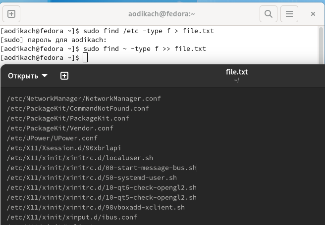{ #fig:001 width=70% }

3. вывожу имена всех файлов из file.txt, имеющих расширение .conf, после чего записываю их в новый текстовой файл conf.txt. (рис. [-@fig:002])

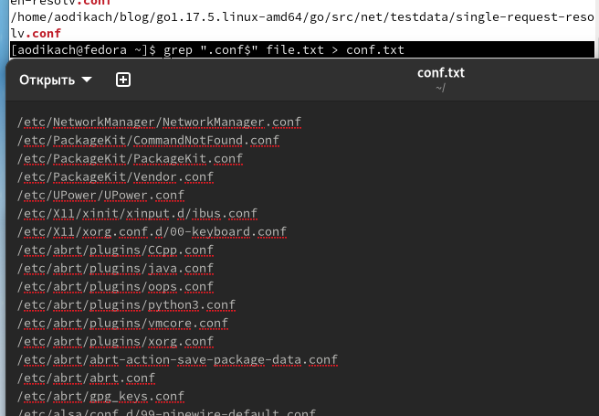{ #fig:002 width=70% }

4. определяю какие файлы в вашем домашнем каталоге имеют имена, начинавшиеся
с символа c. делаю это с помощью команды ls и sudo (рис. [-@fig:003]) (рис. [-@fig:004])

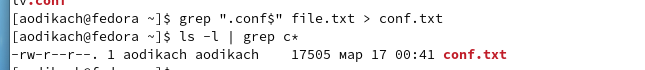{ #fig:003 width=70% }

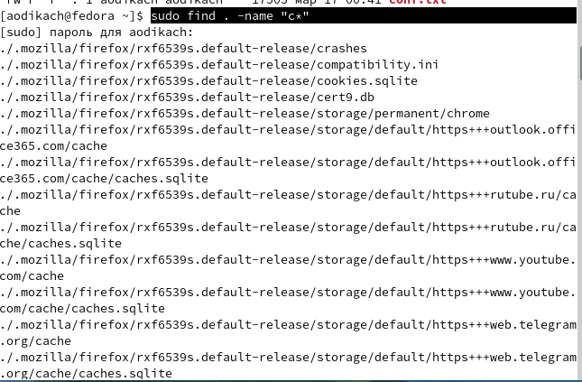{ #fig:004 width=70% }

5. вывожу на экран (по странично) имена файлов из каталога /etc, начинающиеся с символа h.(рис. [-@fig:005])

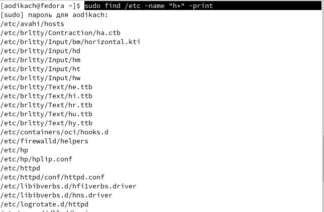{ #fig:005 width=70% }

6. запускаю  в фоновом режиме процесс, который будет записывать в файл ~/logfile файлы, имена которых начинаются с log и удаляю файл ~/logfile. (рис. [-@fig:006])

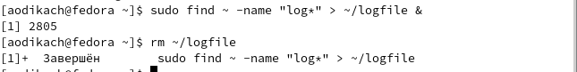{ #fig:006 width=70% }

7. запускаю  из консоли в фоновом режиме редактор gedit (рис. [-@fig:007])

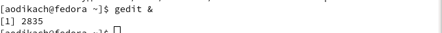{ #fig:007 width=70% }

8. определяю идентификатор процесса gedit, используя команду ps, конвейер и фильтр grep (идентификатор 2835), также идентификатор выводится при использовании pidof (рис. [-@fig:008])

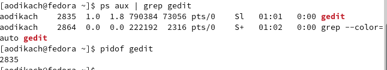{ #fig:008 width=70% }

9. читаю е справку (man) команды kill, после чего использую её для завершения процесса gedit (рис. [-@fig:009])

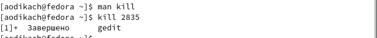{ #fig:009 width=70% }

10. выполняю команды df и du, предварительно получив более подробную информацию об этих командах, с помощью команды man (рис. [-@fig:010])

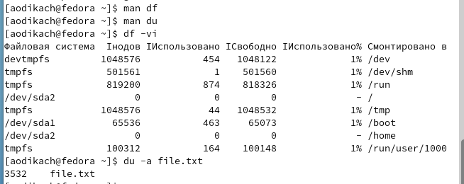{ #fig:010 width=70% }

11. вывожу имена всех директорий, имеющихся в вашем домашнем каталоге с помощью команды sudo find . -type d (рис. [-@fig:011])

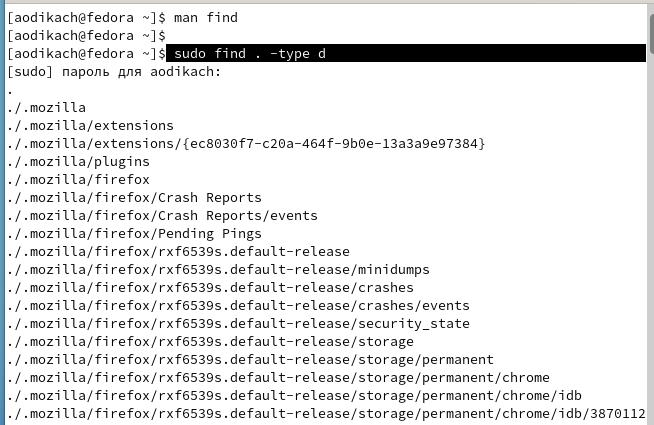{ #fig:011 width=70% }

# Вывод

ознакомилась с инструментами поиска файлов и фильтрации текстовых данных. приобрела практический навык по управлению процессами, проверке использования диска и обслуживанию файловых систем

:::
