---
## Front matter
lang: ru-RU
title: Презентация
subtitle: Лабораторная работа №7
author:
  - Дикач А.О.
institute:
  - Российский университет дружбы народов, Москва, Россия
date: 22.03.2023г.

## i18n babel
babel-lang: russian
babel-otherlangs: english

## Formatting pdf
toc: false
toc-title: Содержание
slide_level: 2
aspectratio: 169
section-titles: true
theme: metropolis
header-includes:
 - \metroset{progressbar=frametitle,sectionpage=progressbar,numbering=fraction}
 - '\makeatletter'
 - '\beamer@ignorenonframefalse'
 - '\makeatother'
---

# Информация

## Докладчик

  * Дикач Анна Олеговна
  * ученик НПИбд-01-22
  * Российский университет дружбы народов
  * [1132222009@pfur.ru]
  * <https://github.com/ANNdamn/study_2022-2023_os-intro>

## Цели и задачи

Освоение основных возможностей командной оболочки Midnight Commander. Приобретение навыков практической работы по просмотру каталогов и файлов; манипуляций с ними.

#Задание по mc  

## изучаю информацию о mc, вызвав в командной строке man mc 

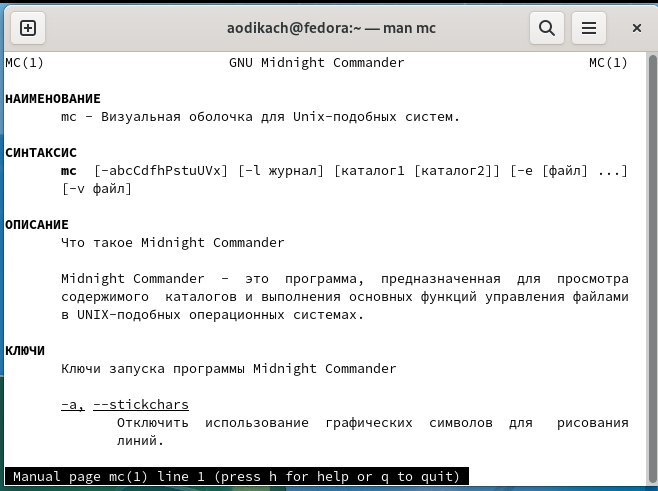{ #fig:001 width=70% }

## запускаю  из командной строки mc, изучаю его структуру и меню 

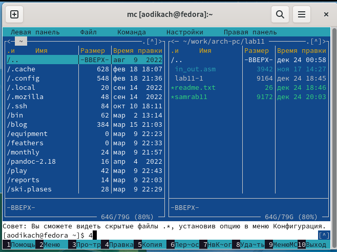{ #fig:002 width=70% }

## выполняю   несколько операций в mc, используя управляющие клавиши

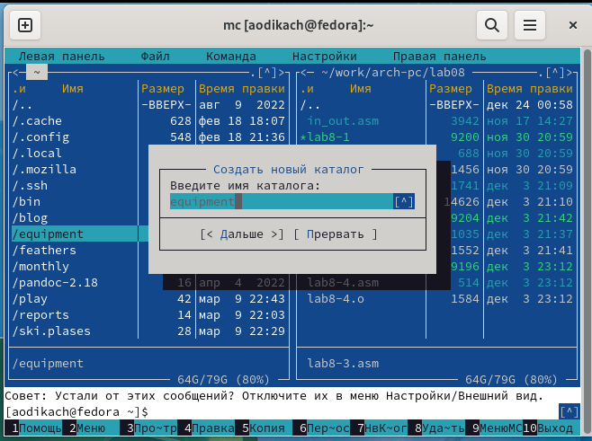{ #fig:003 width=70% }

## выполняю основные команды меню левой (или правой) панели 

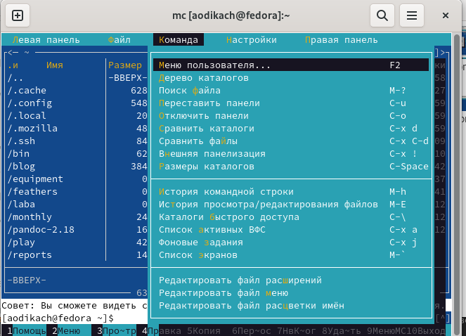{ #fig:020 width=70% }

## вывожу на экран содержимое текстового файла с помощью F3 

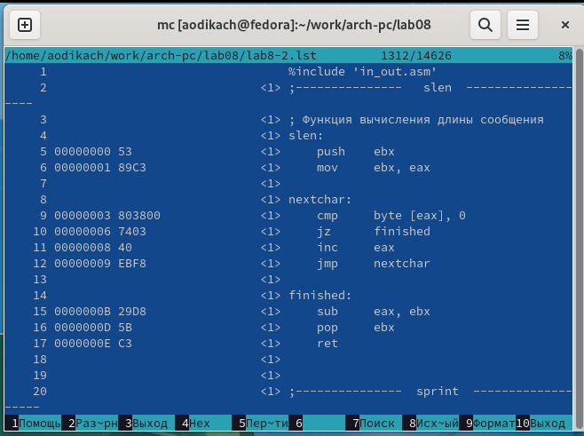{ #fig:004 width=70% }

## редактирование содержимого текстового файла F2

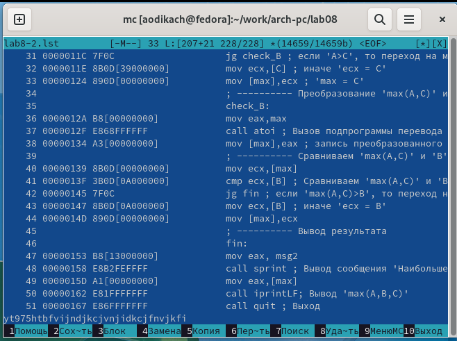{ #fig:005 width=70% }

## создание каталога F7

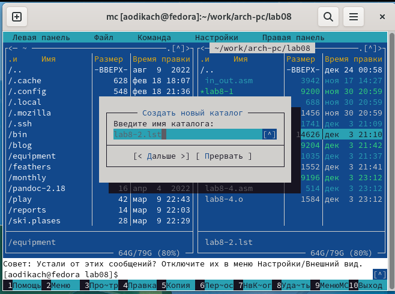{ #fig:006 width=70% }

## копирование файлов в созданный каталог F5  

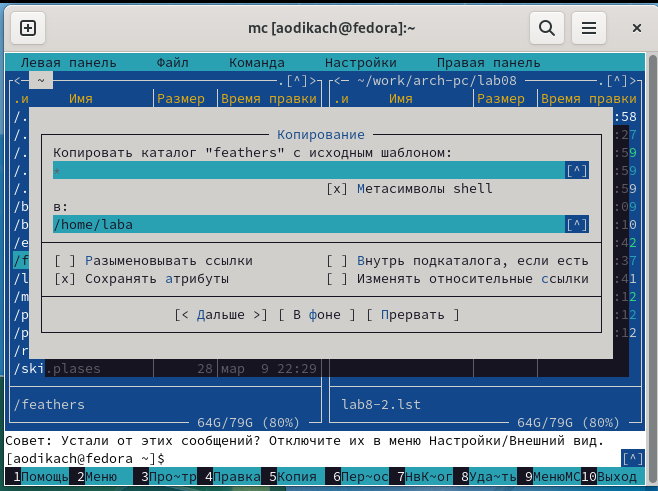{ #fig:007 width=70% }

## поиск в файловой системе файла с заданными условиями 

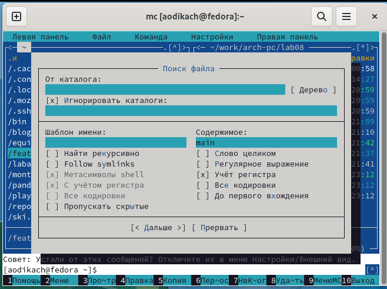{ #fig:008 width=70% }

## выбор и повторение одной из предыдущих команд

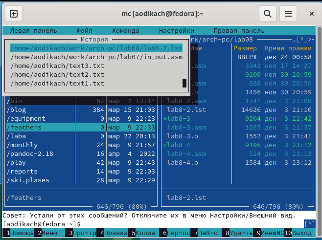{ #fig:009 width=70% }

##переход в домашний каталог 

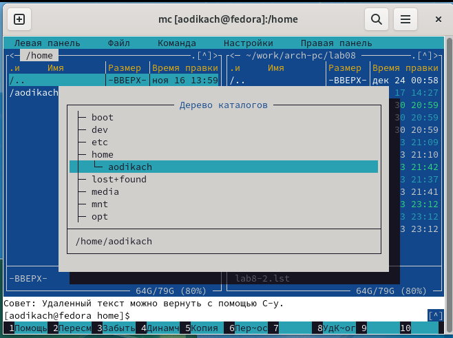{ #fig:010 width=70% }

## анализирую файл меню и файл расширений 

## вызываю подменю настройки и осваиваю операции, определяющие структуру экрана mc

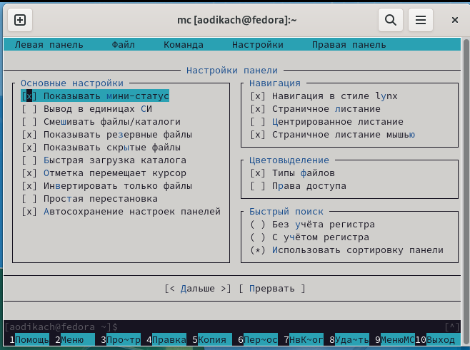{ #fig:011 width=70% }

#Задание по встроенному редактору mc 

## создаю текстовой файл text.txt

## открываю этот файл с помощью встроенного в mc редактора и записываю посторонний текст 

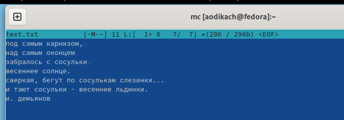{ #fig:012 width=70% }

## удаляю строку текста с помощью ctrl + y

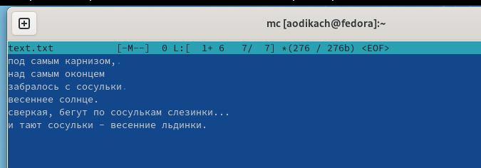{ #fig:013 width=70% }

## выделяю фрагмент текста и копирую на новую строку с помощью F3 F5 и Ins 

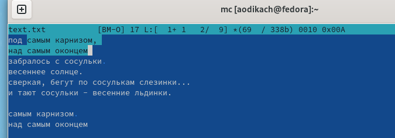{ #fig:014 width=70% }

## выделяю фрагмент текста и перенесите его на новую строку  F6

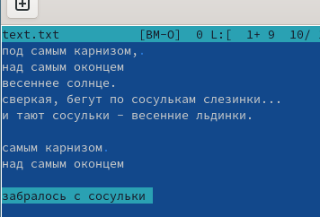{ #fig:015 width=70% }

## сохраняю файл с помощью F2 

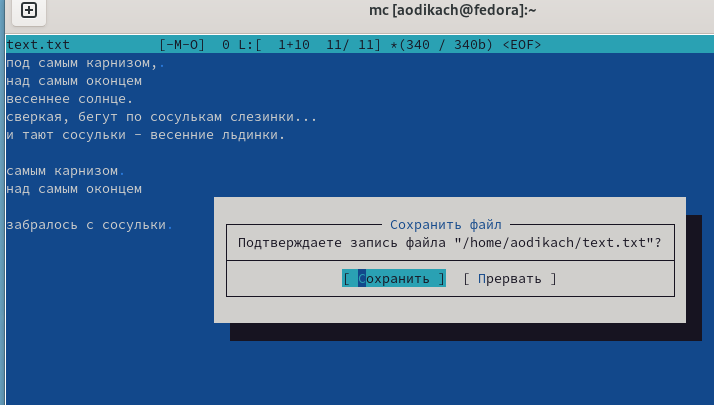{ #fig:016 width=70% }

## отменяю последнее действие с помощью ctrl + u 

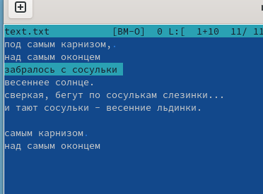{ #fig:017 width=70% }

## перехожу в конец файла с помощью ctrl D

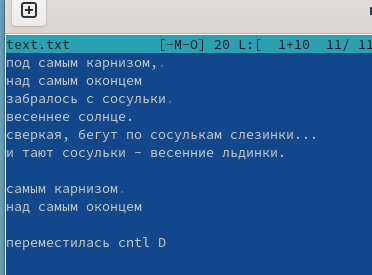{ #fig:018 width=70% }

## перемещаюсь в начало файла 

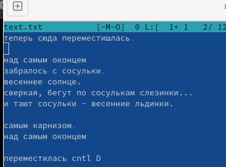{ #fig:019 width=70% }

## Вывод 

Освоила основные возможности командной оболочки Midnight Commander и приобрела навыки практической работы по просмотру файлов и манипуляции ими 

