---
## Front matter
title: "Отчёт по лабораторной работе"
subtitle: "Лабораторная работа №7"
author: "Дикач Анна Олеговна"

## Bibliography
bibliography: bib/cite.bib
csl: pandoc/csl/gost-r-7-0-5-2008-numeric.csl

## Pdf output format
toc: true # Table of contents
toc-depth: 2
lof: true # List of figures
lot: true # List of tables
fontsize: 12pt
linestretch: 1.5
papersize: a4
documentclass: scrreprt
## I18n polyglossia
polyglossia-lang:
  name: russian
  options:
	- spelling=modern
	- babelshorthands=true
polyglossia-otherlangs:
  name: english
## I18n babel
babel-lang: russian
babel-otherlangs: english
## Fonts
mainfont: PT Serif
romanfont: PT Serif
sansfont: PT Sans
monofont: PT Mono
mainfontoptions: Ligatures=TeX
romanfontoptions: Ligatures=TeX
sansfontoptions: Ligatures=TeX,Scale=MatchLowercase
monofontoptions: Scale=MatchLowercase,Scale=0.9
## Biblatex
biblatex: true
biblio-style: "gost-numeric"
biblatexoptions:
  - parentracker=true
  - backend=biber
  - hyperref=auto
  - language=auto
  - autolang=other*
  - citestyle=gost-numeric
## Pandoc-crossref LaTeX customization
figureTitle: "Рис."
tableTitle: "Таблица"
listingTitle: "Листинг"
lofTitle: "Список иллюстраций"
lotTitle: "Список таблиц"
lolTitle: "Листинги"
## Misc options
indent: true
header-includes:
  - \usepackage{indentfirst}
  - \usepackage{float} # keep figures where there are in the text
  - \floatplacement{figure}{H} # keep figures where there are in the text
---

# Цель работы
Освоение основных возможностей командной оболочки Midnight Commander. Приобретение навыков практической работы по просмотру каталогов и файлов; манипуляций с ними. 
# Выполнение лабораторной работы
## Задание по mc
1. изучаю информацию о mc, вызвав в командной строке man mc (рис. [-@fig:001])

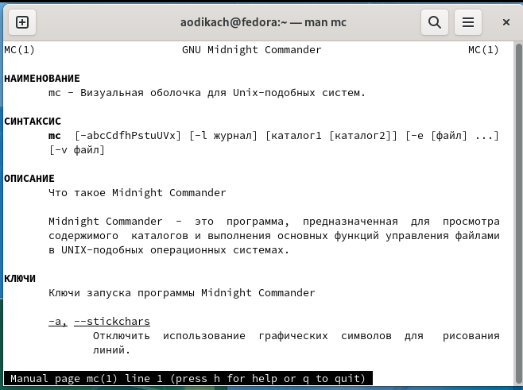{ #fig:001 width=70% }

2. запускаю  из командной строки mc, изучаю его структуру и меню. (рис. [-@fig:002])

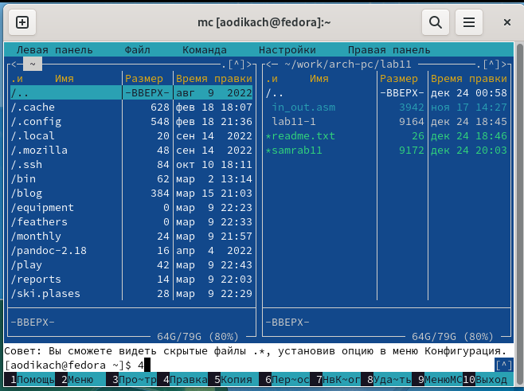{ #fig:002 width=70% }

3. выполняю   несколько операций в mc, используя управляющие клавиши(рис. [-@fig:003])

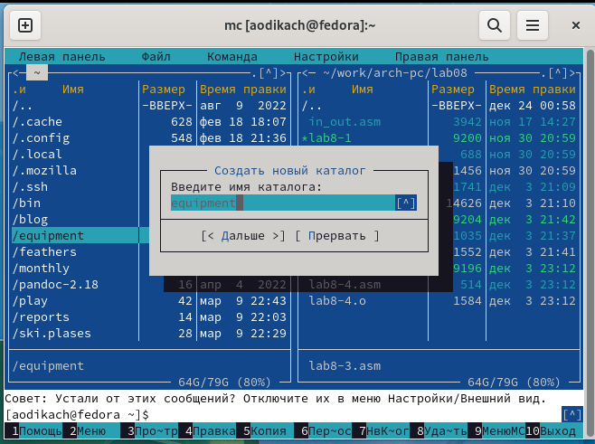{ #fig:003 width=70% }

4. выполняю основные команды меню левой (или правой) панели (рис. [-@fig:020]) 

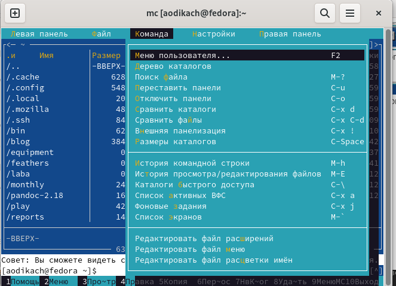{ #fig:020 width=70% }

5. вывожу на экран содержимое текстового файла с помощью F3 (рис. [-@fig:004])

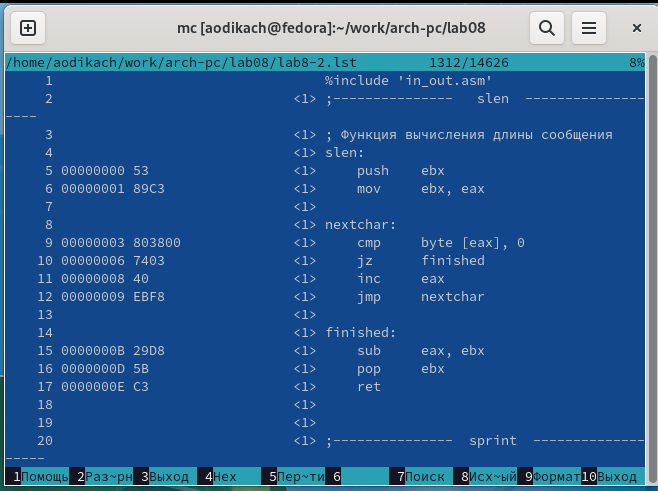{ #fig:004 width=70% }

6. редактирование содержимого текстового файла F2(рис. [-@fig:005])

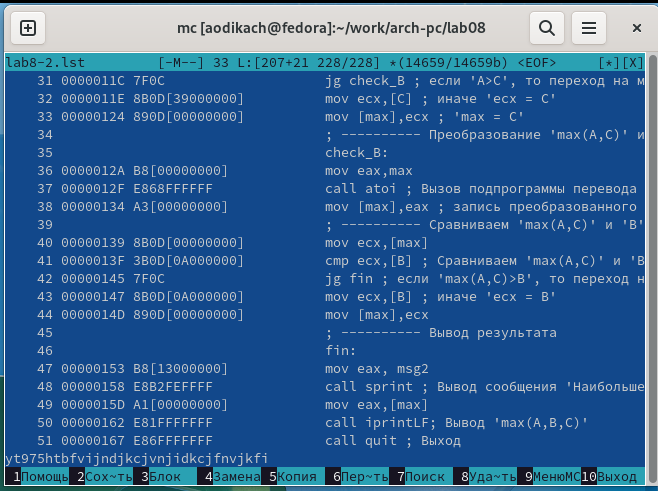{ #fig:005 width=70% }

7. создание каталога F7(рис. [-@fig:006])

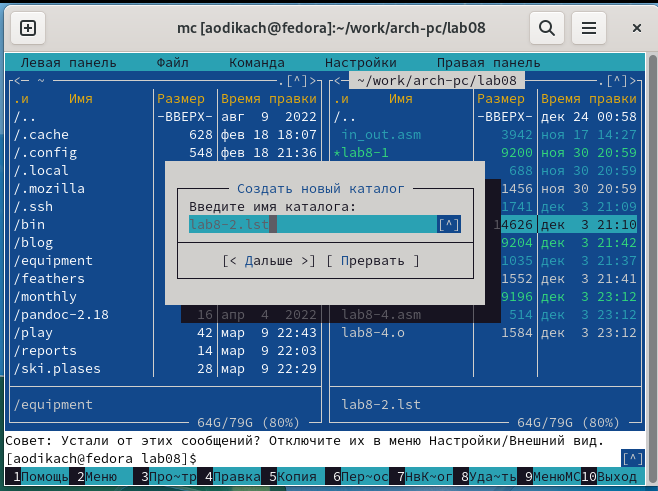{ #fig:006 width=70% }

8. копирование файлов в созданный каталог F5 (рис. [-@fig:007])

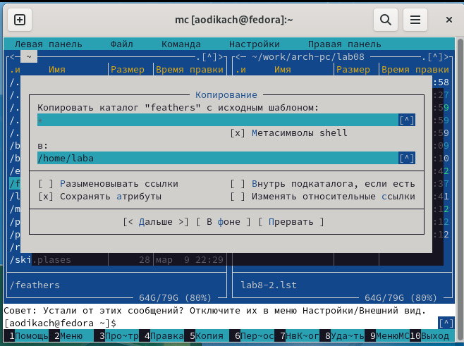{ #fig:007 width=70% }

9.  поиск в файловой системе файла с заданными условиями (рис. [-@fig:008])

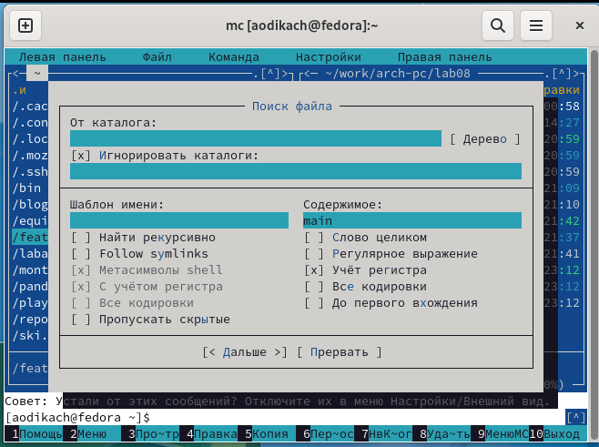{ #fig:008 width=70% }

10. выбор и повторение одной из предыдущих команд (рис. [-@fig:009])

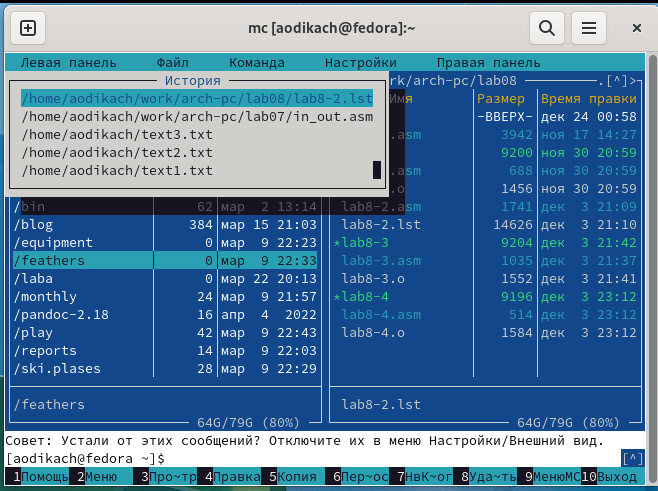{ #fig:009 width=70% }

11. переход в домашний каталог (рис. [-@fig:010])

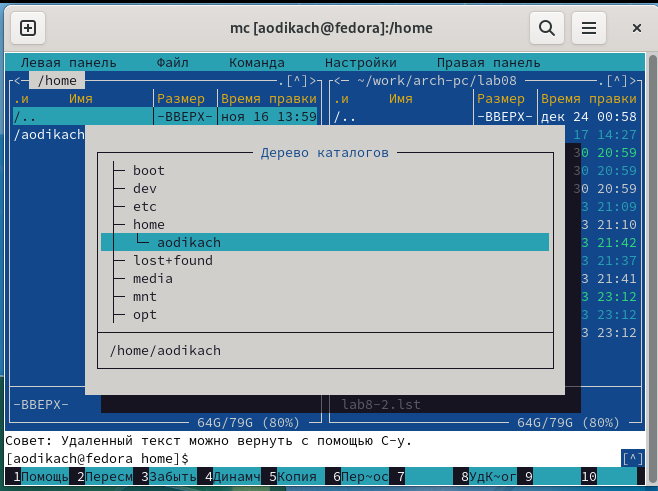{ #fig:010 width=70% }

12. анализирую файл меню и файл расширений 

13. вызываю подменю настройки и осваиваю операции, определяющие структуру экрана mc(рис. [-@fig:011])

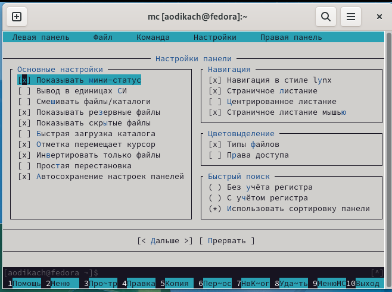{ #fig:011 width=70% }

## Задание по встроенному редактору mc 

14. создаю текстовой файл text.txt

15. открываю этот файл с помощью встроенного в mc редактора и записываю посторонний текст (рис. [-@fig:012])

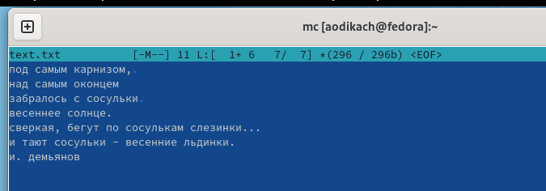{ #fig:012 width=70% }

16. удаляю строку текста с помощью ctrl + y (рис. [-@fig:013])

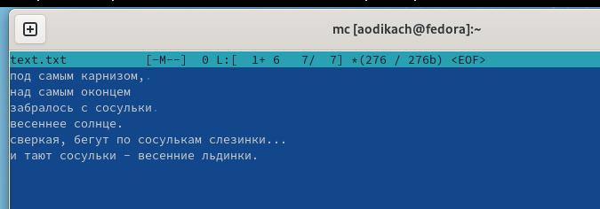{ #fig:013 width=70% }

17. выделяю фрагмент текста и копирую на новую строку с помощью F3 F5 и Ins (рис. [-@fig:014])

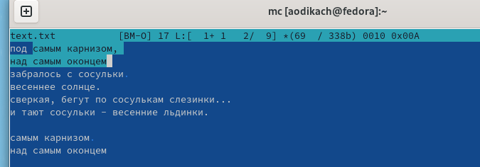{ #fig:014 width=70% }

18. выделяю фрагмент текста и перенесите его на новую строку  F6 (рис. [-@fig:015])

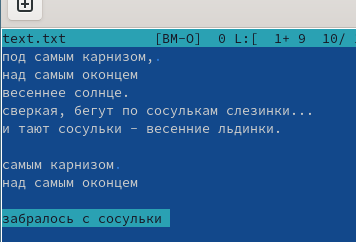{ #fig:015 width=70% }

19. сохраняю файл с помощью F2 (рис. [-@fig:016])

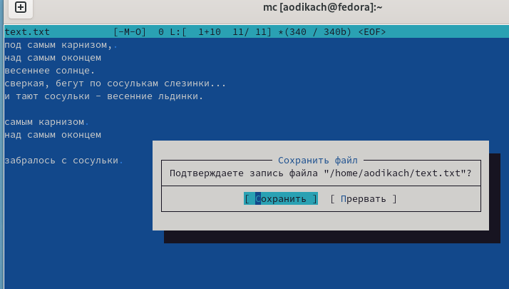{ #fig:016 width=70% }

20. отменяю последнее действие с помощью ctrl + u (рис. [-@fig:017])

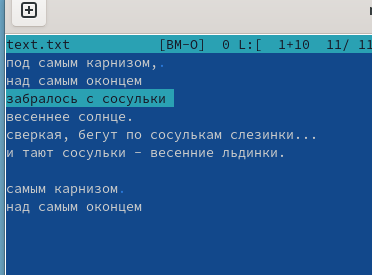{ #fig:017 width=70% }

21. перехожу в конец файла с помощью ctrl D(рис. [-@fig:018])

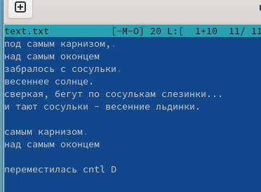{ #fig:018 width=70% }

22. перемещаюсь в начало файла (рис. [-@fig:019])

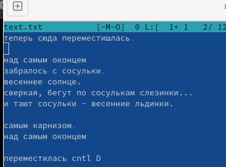{ #fig:019 width=70% }

# Вывод
 
Освоила основные возможности командной оболочки Midnight Commander и приобрела навыки практической работы по просмотру файлов и манипуляции ими 
