---
## Front matter
lang: ru-RU
title: Презентация
subtitle: Лабораторная работа №8
author:
  - Дикач А.О.
institute:
  - Российский университет дружбы народов, Москва, Россия
date: 25.03.2023г.

## i18n babel
babel-lang: russian
babel-otherlangs: english

## Formatting pdf
toc: false
toc-title: Содержание
slide_level: 2
aspectratio: 169
section-titles: true
theme: metropolis
header-includes:
 - \metroset{progressbar=frametitle,sectionpage=progressbar,numbering=fraction}
 - '\makeatletter'
 - '\beamer@ignorenonframefalse'
 - '\makeatother'
---

# Информация

## Докладчик

  * Дикач Анна Олеговна
  * ученик НПИбд-01-22
  * Российский университет дружбы народов
  * [1132222009@pfur.ru]
  * <https://github.com/ANNdamn/study_2022-2023_os-intro>

## Цели и задачи

Познакомиться с операционной системой Linux. Получить практические навыки работы с редактором vi, установленным по умолчанию практически во всех дистрибутивах.

## создаю каталог с именем ~/work/os/lab06

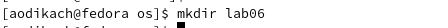{ #fig:001 width=70% }

## перехожу в созданный каталог, нажимаю на клавишу i 

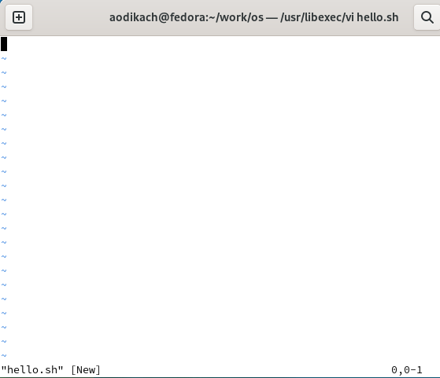{ #fig:002 width=70% }

## ввожу текст

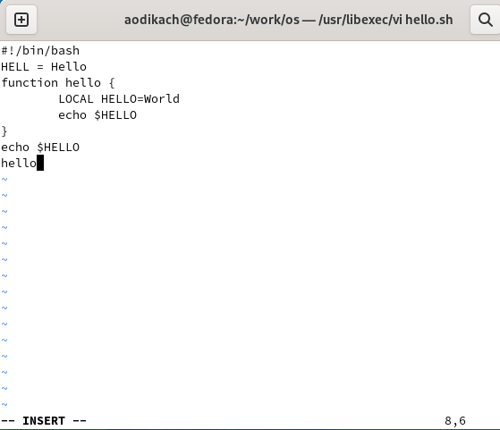{ #fig:003 width=70% }

## нажимаю esc для перехода в командный режим после завершения ввода текста 

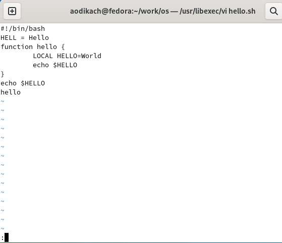{ #fig:004 width=70% }

## нажимаю : для перехода в режим последней строки и ввожу wq для сохранения текста и завершения работы 

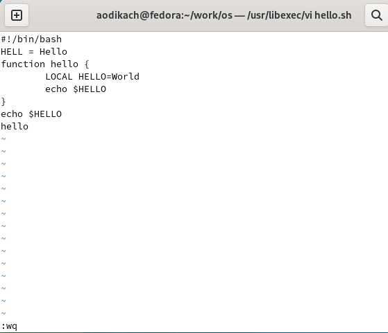{ #fig:005 width=70% }

## делаю файл исполняемым 

{ #fig:006 width=70% }

# Редактирование существующего файла 

## вызываю vi на редактирование файла. устанавливаю курсор в конец слова  HELL второй строки и заменяю на HELLO. возвращаюсь в командный режим. 

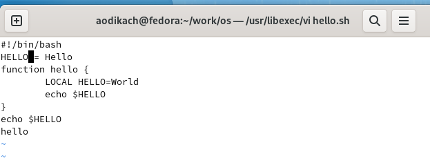{ #fig:007 width=70% }

## устанавливаю курсор на четвертую строку и стираю слово LOCAL с помощью dw

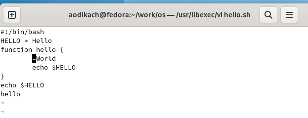{ #fig:008 width=70% }

## перехожу в режим вставки и набираю local (a), возвращаюсь в командный режим 

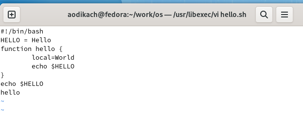{ #fig:009 width=70% }

## устанавливаю курсор на последней строке файла, вставляю строку echo $HELLO (о), перехожу в командный режим 

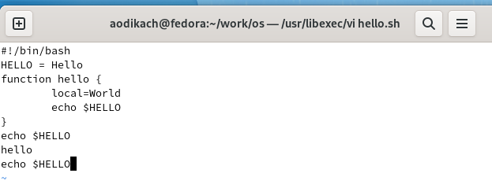{ #fig:010 width=70% }

## удаляю последнюю строку с помощью dd 

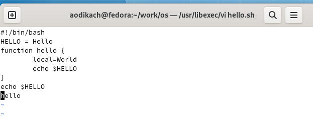{ #fig:011 width=70% }

## ввожу команду отмены изменений u для отмены последней команды 

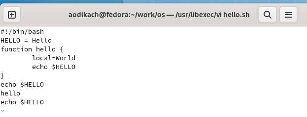{ #fig:012 width=70% }

## ввожу символ : для перехода в режим последней строки. записываю произведённые изменения и выхожу из vi

## Вывод 

Познакомилась с операционной системой Linux. Получила практические навыки работы с редактором vi, установленным по умолчанию практически во всех дистрибутивах. 

