---
## Front matter
title: "Отчёт по лабораторной работе"
subtitle: "Лабораторная работа №8"
author: "Дикач Анна Олеговна"

## Bibliography
bibliography: bib/cite.bib
csl: pandoc/csl/gost-r-7-0-5-2008-numeric.csl

## Pdf output format
toc: true # Table of contents
toc-depth: 2
lof: true # List of figures
lot: true # List of tables
fontsize: 12pt
linestretch: 1.5
papersize: a4
documentclass: scrreprt
## I18n polyglossia
polyglossia-lang:
  name: russian
  options:
	- spelling=modern
	- babelshorthands=true
polyglossia-otherlangs:
  name: english
## I18n babel
babel-lang: russian
babel-otherlangs: english
## Fonts
mainfont: PT Serif
romanfont: PT Serif
sansfont: PT Sans
monofont: PT Mono
mainfontoptions: Ligatures=TeX
romanfontoptions: Ligatures=TeX
sansfontoptions: Ligatures=TeX,Scale=MatchLowercase
monofontoptions: Scale=MatchLowercase,Scale=0.9
## Biblatex
biblatex: true
biblio-style: "gost-numeric"
biblatexoptions:
  - parentracker=true
  - backend=biber
  - hyperref=auto
  - language=auto
  - autolang=other*
  - citestyle=gost-numeric
## Pandoc-crossref LaTeX customization
figureTitle: "Рис."
tableTitle: "Таблица"
listingTitle: "Листинг"
lofTitle: "Список иллюстраций"
lotTitle: "Список таблиц"
lolTitle: "Листинги"
## Misc options
indent: true
header-includes:
  - \usepackage{indentfirst}
  - \usepackage{float} # keep figures where there are in the text
  - \floatplacement{figure}{H} # keep figures where there are in the text
---

# Цель работы

Познакомиться с операционной системой Linux. Получить практические навыки работы с редактором vi, установленным по умолчанию практически во всех дистрибутивах.

# Выполнение лабораторной работы

## Создание нового файла с использованием vi

1. создаю каталог с именем ~/work/os/lab06(рис. [-@fig:001])

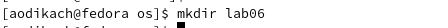{ #fig:001 width=70% }

2. перехожу в созданный каталог, нажимаю на клавишу i (рис. [-@fig:002])

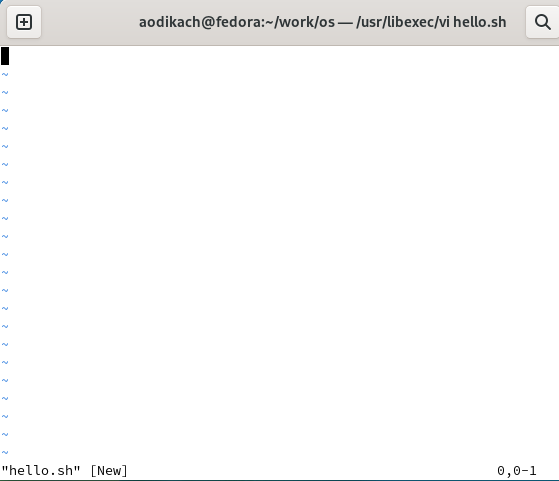{ #fig:002 width=70% }

3. ввожу текст (рис. [-@fig:003])

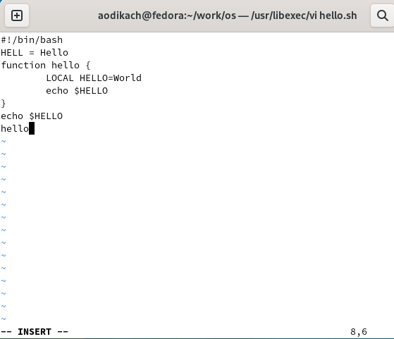{ #fig:003 width=70% }

4. нажимаю esc для перехода в командный режим после завершения ввода текста (рис. [-@fig:004])

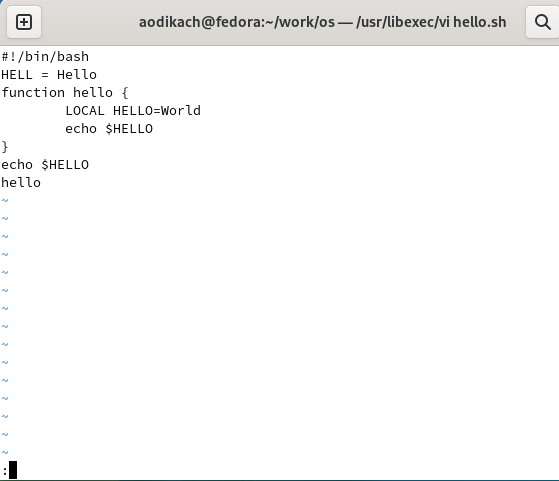{ #fig:004 width=70% }

5. нажимаю : для перехода в режим последней строки и ввожу wq для сохранения текста и завершения работы (рис. [-@fig:005])

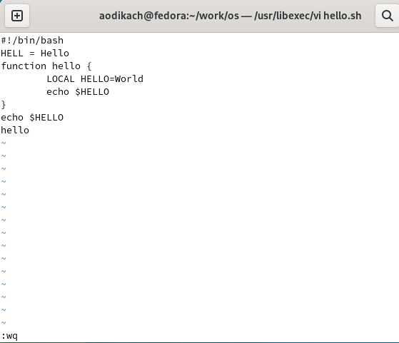{ #fig:005 width=70% }

6. делаю файл исполняемым (рис. [-@fig:006])

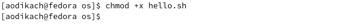{ #fig:006 width=70% }

## Редактирование существующего файла 

7. вызываю vi на редактирование файла. устанавливаю курсор в конец слова  HELL второй строки и заменяю на HELLO. возвращаюсь в командный режим. (рис. [-@fig:007])

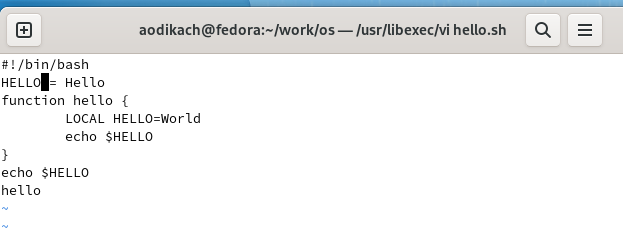{ #fig:007 width=70% }

8. устанавливаю курсор на четвертую строку и стираю слово LOCAL с помощью dw(рис. [-@fig:008])

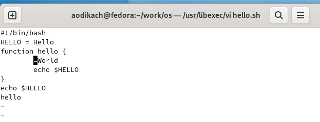{ #fig:008 width=70% }

9. перехожу в режим вставки и набираю local (a), возвращаюсь в командный режим (рис. [-@fig:009])

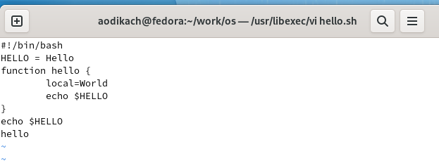{ #fig:009 width=70% }

10. устанавливаю курсор на последней строке файла, вставляю строку echo $HELLO (о), перехожу в командный режим (рис. [-@fig:010])

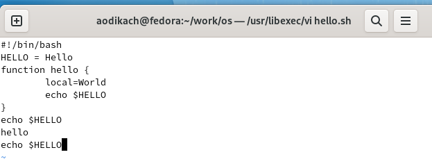{ #fig:010 width=70% }

11.  удаляю последнюю строку с помощью dd (рис. [-@fig:011])

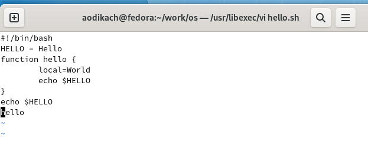{ #fig:011 width=70% }

12.  ввожу команду отмены изменений u для отмены последней команды (рис. [-@fig:012])

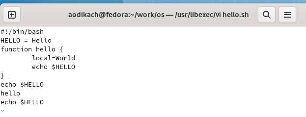{ #fig:012 width=70% }

13. ввожу символ : для перехода в режим последней строки. записываю произведённые изменения и выхожу из vi

# Вывод
 
Познакомилась с операционной системой Linux. Получила практические навыки работы с редактором vi, установленным по умолчанию практически во всех дистрибутивах. 
