---
## Front matter
lang: ru-RU
title: Презентация
subtitle: Лабораторная работа №9
author:
  - Дикач А.О.
institute:
  - Российский университет дружбы народов, Москва, Россия
date: 28.03.2023г.

## i18n babel
babel-lang: russian
babel-otherlangs: english

## Formatting pdf
toc: false
toc-title: Содержание
slide_level: 2
aspectratio: 169
section-titles: true
theme: metropolis
header-includes:
 - \metroset{progressbar=frametitle,sectionpage=progressbar,numbering=fraction}
 - '\makeatletter'
 - '\beamer@ignorenonframefalse'
 - '\makeatother'
---

# Информация

## Докладчик

  * Дикач Анна Олеговна
  * ученик НПИбд-01-22
  * Российский университет дружбы народов
  * [1132222009@pfur.ru]
  * <https://github.com/ANNdamn/study_2022-2023_os-intro>

## Цели и задачи

Познакомиться с операционной системой Linux. Получить практические навыки работы с редактором Emacs.

## открываю emacs и создаю файл lab07.sh с помощью комбинации Ctrl-x Ctrl-f

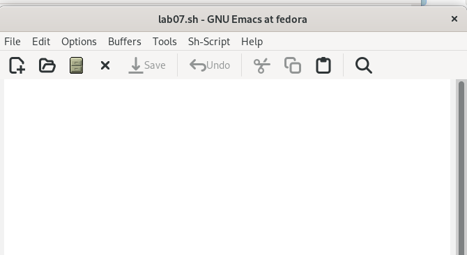{ #fig:001 width=70% }

## ввожу текст программы. сохраняю файл с помощью комбинации Ctrl-x Ctrl-s. вырезаю строку echo $HELLO (С-k) и вставляю её в конец файла (C-y) 

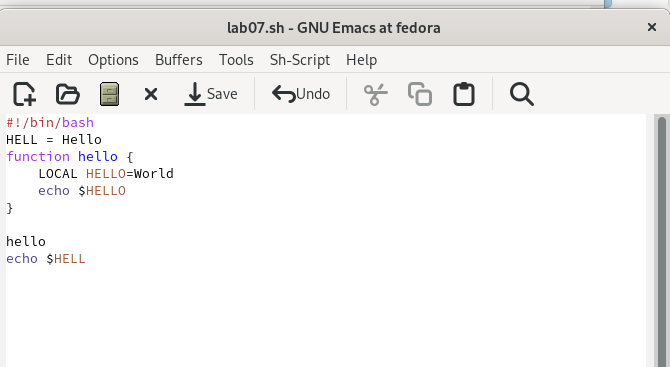{ #fig:002 width=70% }

## выделяю область текста (C-space) и копирую область в буфер обмена (M-w) 

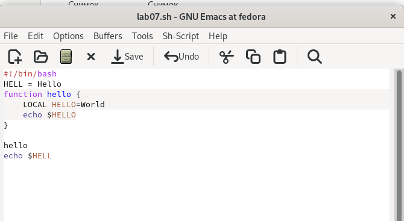{ #fig:003 width=70% }

## вставляю  область в конец файла 

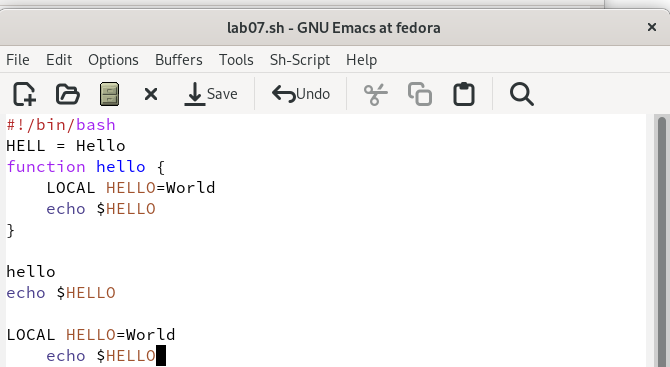{ #fig:004 width=70% }

## вновь выделяю эту область и вырезаю её (C-w) 

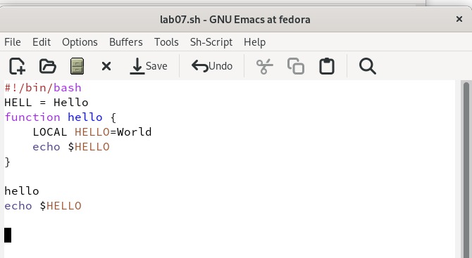{ #fig:005 width=70% }

## отменяю последнее действие (C-/) 

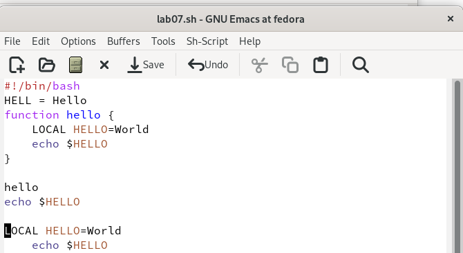{ #fig:006 width=70% }

## перемещаю курсор:

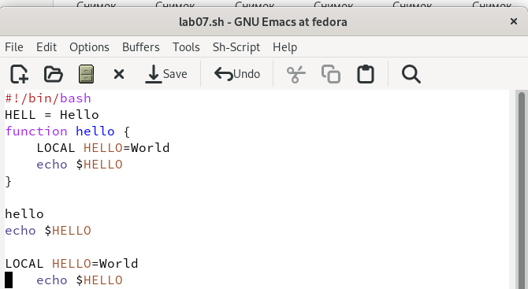{ #fig:007 width=20% }

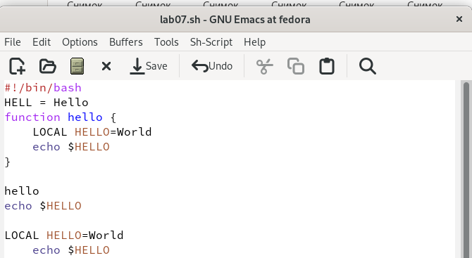{ #fig:008 width=20% }

## перемещаю курсор: 

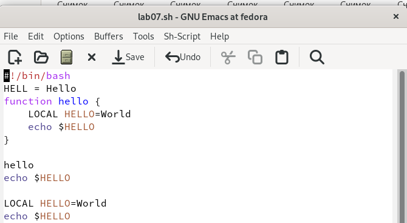{ #fig:009 width=20% }

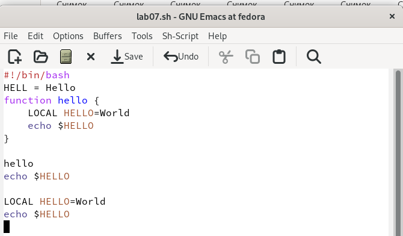{ #fig:010 width=20% }

## вывожу активные буферы на экран (C-x C-b)

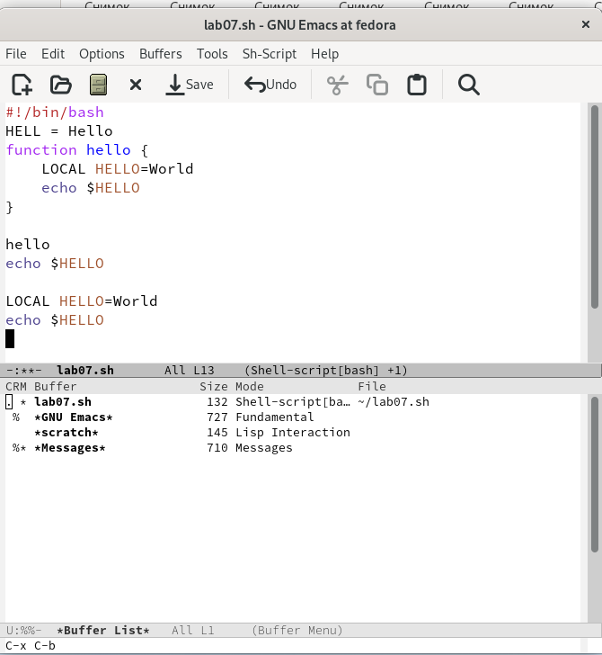{ #fig:011 width=70% }

## перемещаюсь во вновь открытое окно (C-x) o со списком открытых буферов и переключаюсь на другой буфер

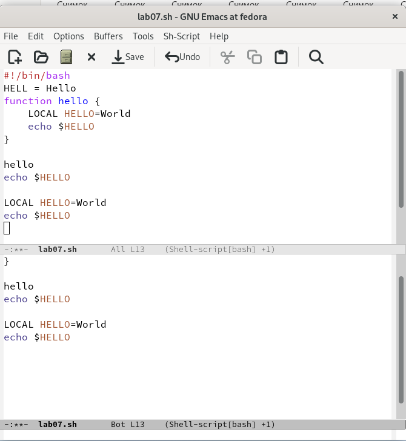{ #fig:012 width=70% }

## закрываю окно (C-x 0)

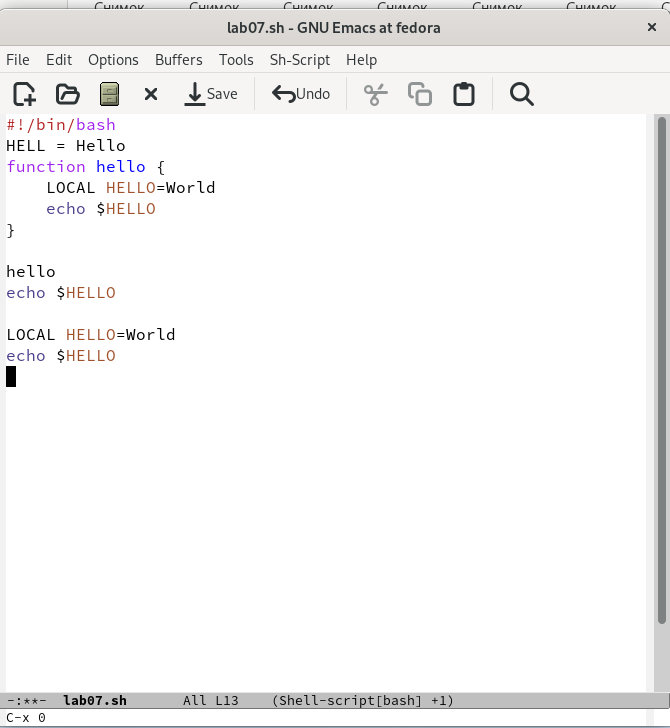{ #fig:013 width=70% }

## вновь переключаюсь между буферами, но уже без вывода их списка наэкран (C-x b) 

{ #fig:014 width=70% }

## делю фрейм на 4 окна: на два окна по вертикали (C-x 3), а затем каждое из этих окон на две части по горизонтали (C-x 2)

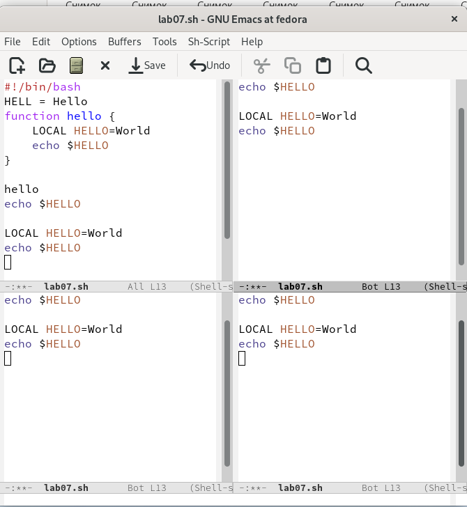{ #fig:015 width=70% }

## открываю в каждом из окон новый буфер 

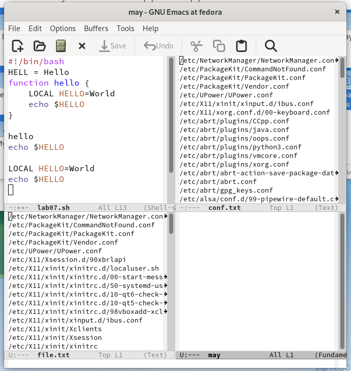{ #fig:016 width=70% }

## переключаюсь в режим поиска (C-s) и нахожу слово hello. переключаюсь между результатами поиска, нажимая C-s

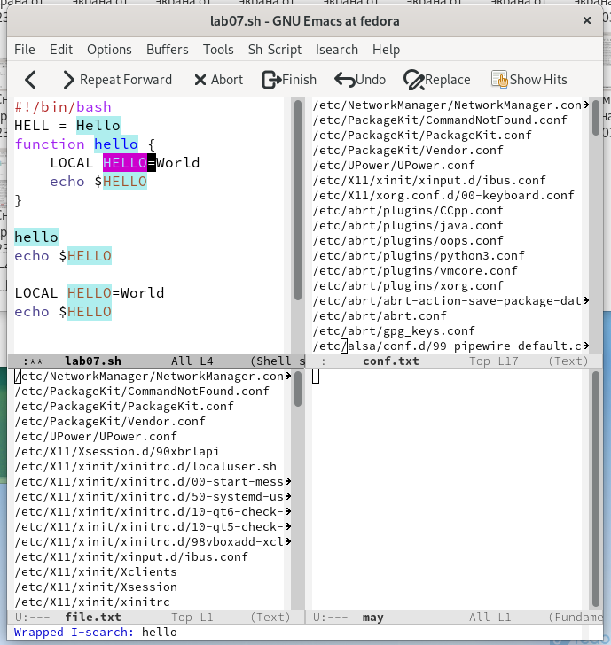{ #fig:017 width=70% }

## выхожу из режима поиска C-g 

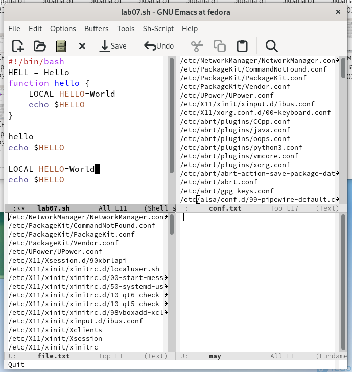{ #fig:018 width=70% }

## Вывод 

Познакомилась с операционной системой Linux. Получила практические навыки работы с редактором Emacs.
