---
## Front matter
title: "Отчёт по лабораторной работе"
subtitle: "Лабораторная работа №9"
author: "Дикач Анна Олеговна"

## Bibliography
bibliography: bib/cite.bib
csl: pandoc/csl/gost-r-7-0-5-2008-numeric.csl

## Pdf output format
toc: true # Table of contents
toc-depth: 2
lof: true # List of figures
lot: true # List of tables
fontsize: 12pt
linestretch: 1.5
papersize: a4
documentclass: scrreprt
## I18n polyglossia
polyglossia-lang:
  name: russian
  options:
	- spelling=modern
	- babelshorthands=true
polyglossia-otherlangs:
  name: english
## I18n babel
babel-lang: russian
babel-otherlangs: english
## Fonts
mainfont: PT Serif
romanfont: PT Serif
sansfont: PT Sans
monofont: PT Mono
mainfontoptions: Ligatures=TeX
romanfontoptions: Ligatures=TeX
sansfontoptions: Ligatures=TeX,Scale=MatchLowercase
monofontoptions: Scale=MatchLowercase,Scale=0.9
## Biblatex
biblatex: true
biblio-style: "gost-numeric"
biblatexoptions:
  - parentracker=true
  - backend=biber
  - hyperref=auto
  - language=auto
  - autolang=other*
  - citestyle=gost-numeric
## Pandoc-crossref LaTeX customization
figureTitle: "Рис."
tableTitle: "Таблица"
listingTitle: "Листинг"
lofTitle: "Список иллюстраций"
lotTitle: "Список таблиц"
lolTitle: "Листинги"
## Misc options
indent: true
header-includes:
  - \usepackage{indentfirst}
  - \usepackage{float} # keep figures where there are in the text
  - \floatplacement{figure}{H} # keep figures where there are in the text
---

# Цель работы

Познакомиться с операционной системой Linux. Получить практические навыки работы с редактором Emacs.

# Выполнение лабораторной работы

1. открываю emacs и создаю файл lab07.sh с помощью комбинации Ctrl-x Ctrl-f(рис. [-@fig:001])

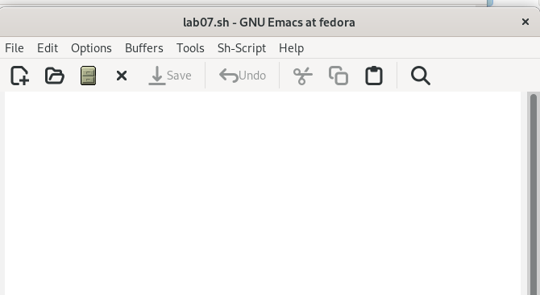{ #fig:001 width=70% }

2. ввожу текст программы. сохраняю файл с помощью комбинации Ctrl-x Ctrl-s. вырезаю строку echo $HELLO (С-k) и вставляю её в конец файла (C-y) (рис. [-@fig:002])

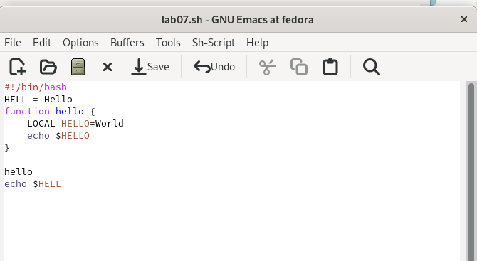{ #fig:002 width=70% }

3. выделяю область текста (C-space) и копирую область в буфер обмена (M-w) (рис. [-@fig:003])

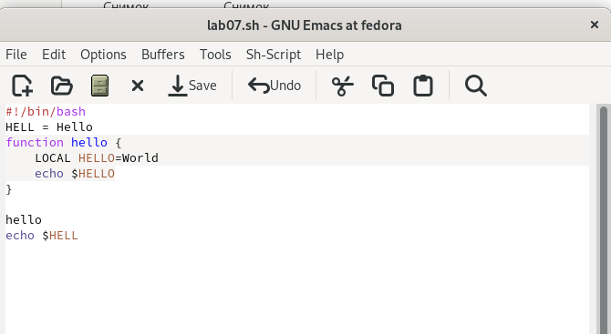{ #fig:003 width=70% }

4. вставляю  область в конец файла (рис. [-@fig:004])

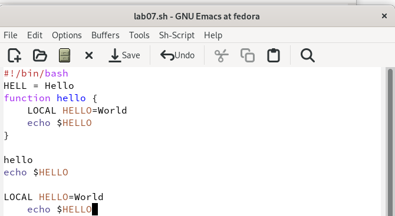{ #fig:004 width=70% }

5. вновь выделяю эту область и вырезаю её (C-w) (рис. [-@fig:005])

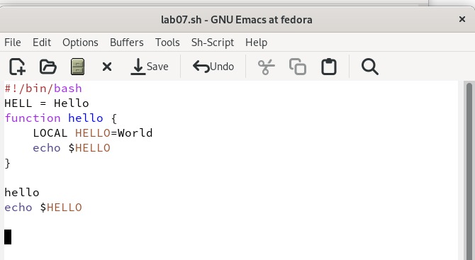{ #fig:005 width=70% }

6. отменяю последнее действие (C-/) (рис. [-@fig:006])

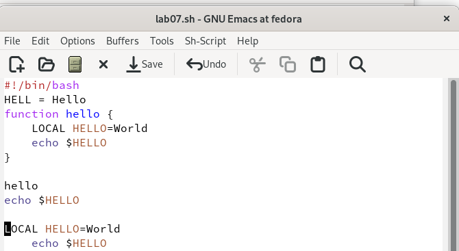{ #fig:006 width=70% }

7. перемещаю курсор: (рис. [-@fig:007]) (рис. [-@fig:008]) (рис. [-@fig:009]) (рис. [-@fig:010])

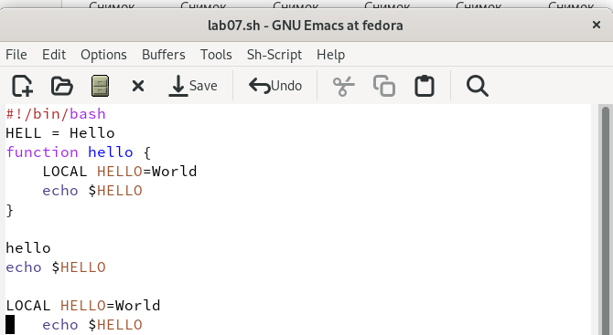{ #fig:007 width=70% }

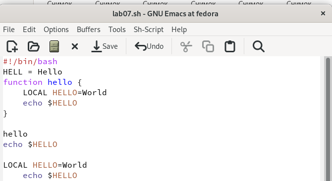{ #fig:008 width=70% }

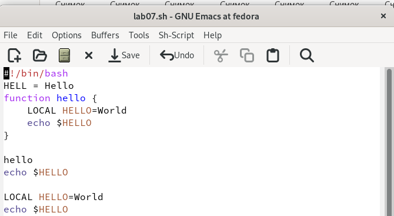{ #fig:009 width=70% }

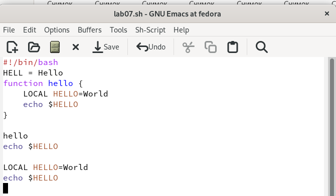{ #fig:010 width=70% }

8. вывожу активные буферы на экран (C-x C-b) (рис. [-@fig:011])

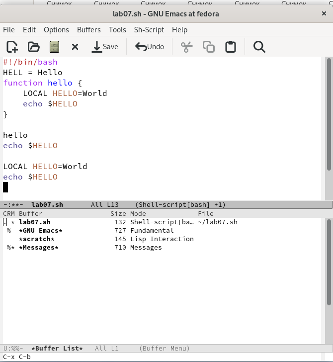{ #fig:011 width=70% }

9. перемещаюсь во вновь открытое окно (C-x) o со списком открытых буферов и переключаюсь на другой буфер (рис. [-@fig:012])

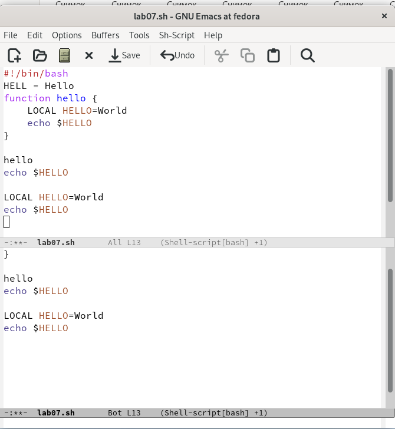{ #fig:012 width=70% }

10. закрываю окно (C-x 0) (рис. [-@fig:013])

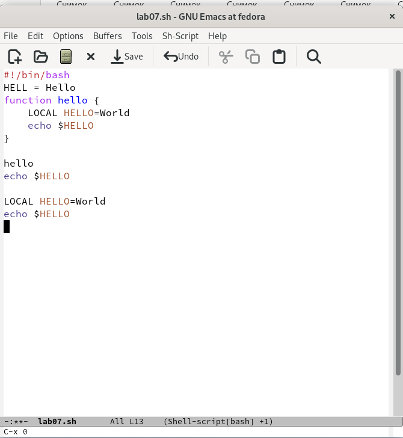{ #fig:013 width=70% }

11. вновь переключаюсь между буферами, но уже без вывода их списка наэкран (C-x b)  (рис. [-@fig:014])

{ #fig:014 width=70% }

12.  делю фрейм на 4 окна: на два окна по вертикали (C-x 3), а затем каждое из этих окон на две части по горизонтали (C-x 2)(рис. [-@fig:015])

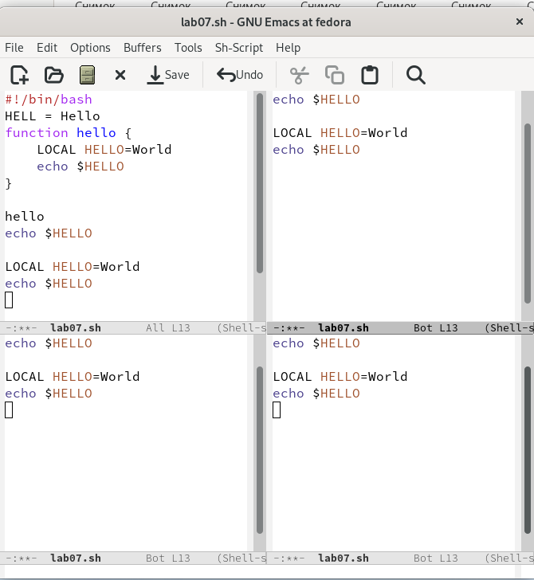{ #fig:015 width=70% }

13.  открываю в каждом из окон новый буфер (рис. [-@fig:016])

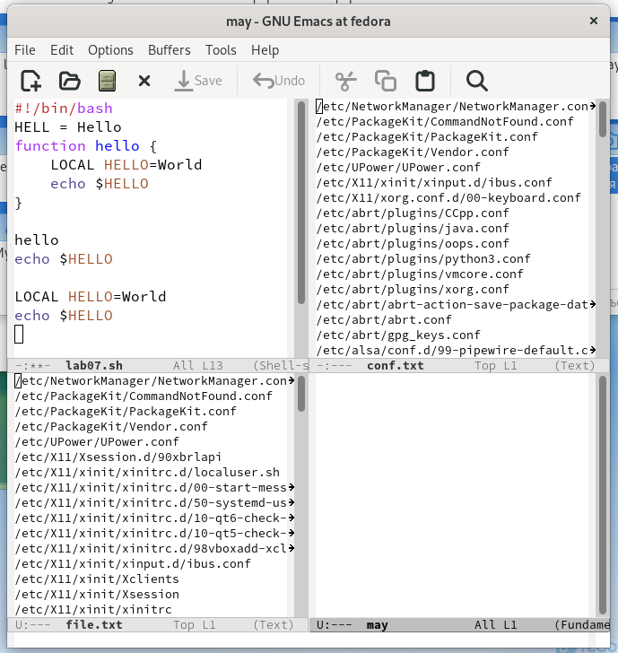{ #fig:016 width=70% }

14. переключаюсь в режим поиска (C-s) и нахожу слово hello. переключаюсь между результатами поиска, нажимая C-s (рис. [-@fig:017])

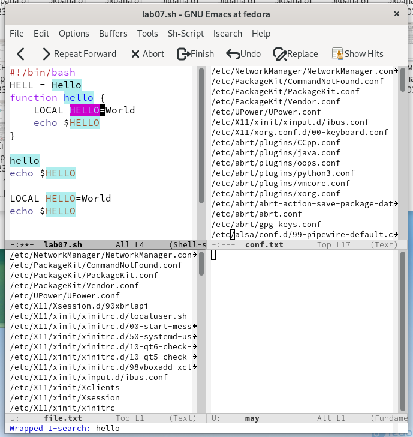{ #fig:017 width=70% }

15.  выхожу из режима поиска C-g (рис. [-@fig:018])

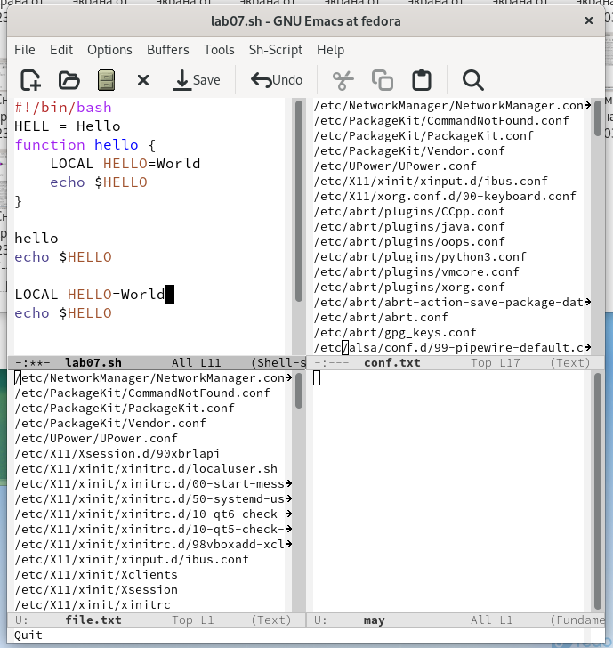{ #fig:018 width=70% }

# Вывод
 
Познакомилась с операционной системой Linux. Получила практические навыки работы с редактором Emacs.
