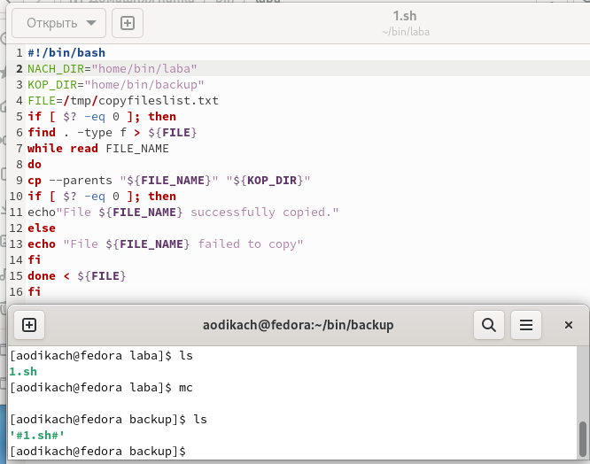
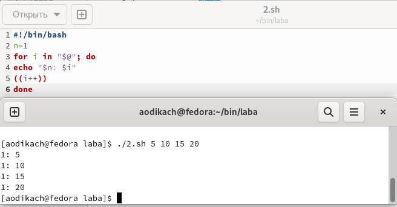
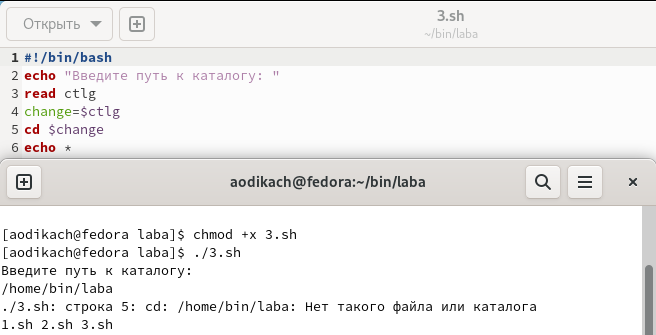

---
## Front matter
lang: ru-RU
title: Презентация
subtitle: Лабораторная работа №10
author:
  - Дикач А.О.
institute:
  - Российский университет дружбы народов, Москва, Россия
date: 10.04.2023г.

## i18n babel
babel-lang: russian
babel-otherlangs: english

## Formatting pdf
toc: false
toc-title: Содержание
slide_level: 2
aspectratio: 169
section-titles: true
theme: metropolis
header-includes:
 - \metroset{progressbar=frametitle,sectionpage=progressbar,numbering=fraction}
 - '\makeatletter'
 - '\beamer@ignorenonframefalse'
 - '\makeatother'
---

# Информация

## Докладчик

  * Дикач Анна Олеговна
  * ученик НПИбд-01-22
  * Российский университет дружбы народов
  * [1132222009@pfur.ru]
  * <https://github.com/ANNdamn/study_2022-2023_os-intro>

## Цели и задачи

Изучить основы программирования в оболочке ОС UNIX/Linux. Научиться писать небольшие командные файлы

## Написать скрипт, который при запуске будет делать резервную копию самого себя (то есть файла, в котором содержится его исходный код) в другую директорию backup в вашем домашнем каталоге. При этом файл должен архивироваться одним из архиваторов на выбор zip, bzip2 или tar. Способ использования команд архивации необходимо узнать, изучив справку

{ #fig:001 width=40% }

## Написать пример командного файла, обрабатывающего любое произвольное число аргументов командной строки, в том числе превышающее десять. Например, скрипт может последовательно распечатывать значения всех переданных аргументов

{ #fig:002 width=70% }

## Написать командный файл — аналог команды ls (без использования самой этой команды и команды dir). Требуется, чтобы он выдавал информацию о нужном каталоге- и выводил информацию о возможностях доступа к файлам этого каталога. 

{ #fig:003 width=70% }

## Вывод 

Научилась основам программирования в оболочке ОС UNIX/Linux и писать небольшие командные файлы
