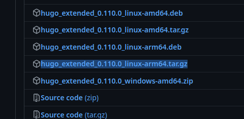
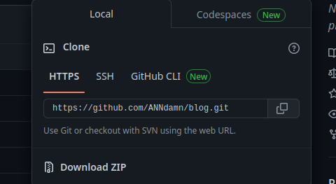
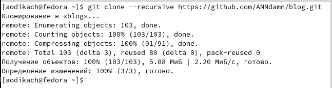
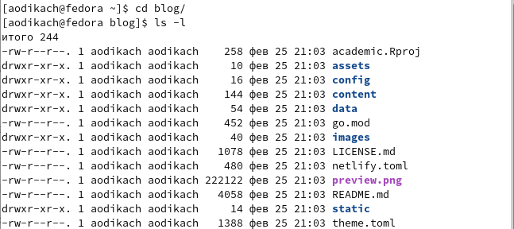
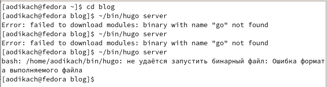

---
## Front matter
lang: ru-RU
title: Презентация
subtitle: Индивидуальный проект стадия 1
author:
  - Дикач А.О.
institute:
  - Российский университет дружбы народов, Москва, Россия
date: 23.02.2023г.

## i18n babel
babel-lang: russian
babel-otherlangs: english

## Formatting pdf
toc: false
toc-title: Содержание
slide_level: 2
aspectratio: 169
section-titles: true
theme: metropolis
header-includes:
 - \metroset{progressbar=frametitle,sectionpage=progressbar,numbering=fraction}
 - '\makeatletter'
 - '\beamer@ignorenonframefalse'
 - '\makeatother'
---

# Информация

## Докладчик

  * Дикач Анна Олеговна
  * ученик НПИбд-01-22
  * Российский университет дружбы народов
  * [1132222009@pfur.ru]
  * <https://github.com/ANNdamn/study_2022-2023_os-intro>

## Цели и задачи

- установить необходимое программное обеспечение
- скачать шаблон темы сайта
- разместить его на хостинге git
- установить параметр для URLs сайта
- разместить заготовку сайта на Github pages

## Выполнение индивидуального проекта

## скачивание исполняемого файла hugo

{width=60%}

## клонированее заранее созданного репозитория 

{ #fig:002 width=40% }

{ #fig:003 width=40% }

## переход в blog и просмотр скаченных файлов

{width=60%}

## неудача выполнения команды ~/bin/hugo 

{width=60%}

## Вывод 

научилась скачивать исполняемый файл, клонировать созданный репозиторий и просматривать файлы каталога

