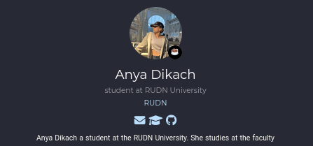
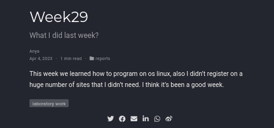
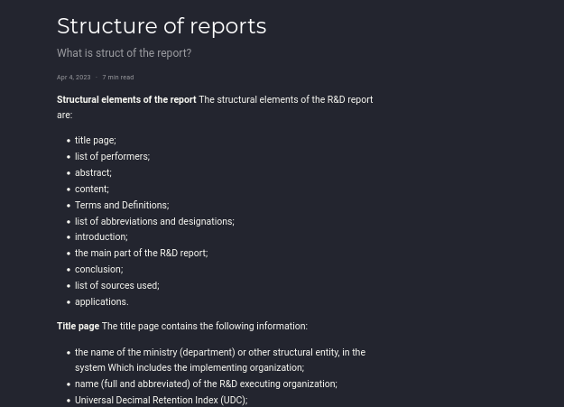

---
## Front matter
lang: ru-RU
title: Презентация
subtitle: Индивидуальный проект стадия 4
author:
  - Дикач А.О.
institute:
  - Российский университет дружбы народов, Москва, Россия
date: 29.04.2023г.

## i18n babel
babel-lang: russian
babel-otherlangs: english

## Formatting pdf
toc: false
toc-title: Содержание
slide_level: 2
aspectratio: 169
section-titles: true
theme: metropolis
header-includes:
 - \metroset{progressbar=frametitle,sectionpage=progressbar,numbering=fraction}
 - '\makeatletter'
 - '\beamer@ignorenonframefalse'
 - '\makeatother'
---

# Информация

## Докладчик

  * Дикач Анна Олеговна
  * ученик НПИбд-01-22
  * Российский университет дружбы народов
  * [1132222009@pfur.ru]
  * <https://github.com/ANNdamn/study_2022-2023_os-intro>

## Цели и задачи

Внести корректировки в персональный сайт, создать пост о прошедшей неделе и о структуре отчётов

## Добавляю  контакты 

{ #fig:001 width=70% }

## Добавляю пост о прошедшей неделе

{ #fig:002 width=30% }

## Добавляю пост о структуре отчётов

{ #fig:003 width=60% }

## Вывод 

Сделала свой сайт актуальным и создала новые посты

